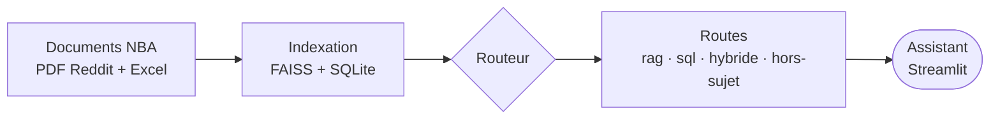

# Évaluez les performances d'un LLM

Assistant d'analyse NBA basé sur une approche RAG (*Retrieval-Augmented Generation*).

L'application permet d'interroger des sources NBA mixtes : archives Reddit extraites par OCR, documents PDF et fichier Excel de statistiques. Les documents texte sont indexés dans FAISS ; les statistiques Excel sont chargées dans SQLite pour les questions chiffrées. L'ensemble est accessible via une interface Streamlit et un modèle Mistral.

Versions repères :

| Nom | Description | Tag Git |
|---|---|---|
| **RAG v1 — baseline** | pipeline RAG initial | `rag-v1-baseline` |
| **RAG v2 — contrôlé** | ajout de Pydantic, Pydantic AI et Logfire | `rag-v2-controlled` |
| **RAG v3 — SQL contrôlé (benchmark)** | routage RAG / SQL avec SQLite + SQL Tool, requêtes SQL prédéfinies (benchmark sécurisé) | `rag-v3-sql-hybrid` |
| **RAG v4 — agent LLM→SQL (version finale)** | le LLM détecte la question chiffrée, génère la requête, exécutée en lecture seule par le SQL Tool | `rag-v4-llm-sql-final` |

Pour une vue d'ensemble en une minute, voir le [résumé exécutif du rapport](docs/final_report.md#résumé-exécutif).

## Sommaire

- [Architecture](#architecture)
- [Structure du dépôt](#structure-du-dépôt)
- [Prérequis](#prérequis)
- [Installation](#installation)
- [Qualité de code](#qualité-de-code)
- [Commandes utiles](#commandes-utiles)
- [Utilisation](#utilisation)
  - [Indexation des documents](#indexation-des-documents)
  - [Option OCR Nanonets](#option-ocr-nanonets)
  - [Lancement de l'application](#lancement-de-lapplication)
- [Routage RAG / SQL](#routage-rag--sql)
- [Évaluation et résultats](#évaluation-et-résultats)
  - [Audit et limites](#audit-et-limites)
  - [Dataset d'évaluation](#dataset-dévaluation)
  - [Validation et génération structurée](#validation-et-génération-structurée)
  - [Baseline RAGAS et versions repères](#baseline-ragas-et-versions-repères)
- [Observabilité](#observabilité)
- [SQL Tool LangChain (lecture seule)](#sql-tool-langchain-lecture-seule)
- [Modes SQL : benchmark contrôlé et version finale LLM→SQL](#modes-sql--benchmark-contrôlé-et-version-finale-llmsql)
- [Option PlotTool (visualisations)](#option-plottool-visualisations)
- [Annexe — Expérience OCR Nanonets](#annexe--expérience-ocr-nanonets)

## Architecture

Vue simplifiée du système : les documents NBA sont indexés (FAISS pour le texte, SQLite pour les statistiques), puis un routeur dirige chaque question vers la bonne route avant de répondre dans Streamlit.



Voir le schéma d'architecture détaillé dans le rapport : [docs/final_report.md](docs/final_report.md#architecture-générale).

## Structure du dépôt

```text
.
├── docs/
│   ├── audit_initial.md         # Synthèse de l'audit initial
│   ├── final_report.md          # Rapport de mise en place et d'évaluation
│   └── img/                     # Captures utilisées dans le rapport
├── evaluation/
│   ├── evaluation_questions.csv              # Jeu figé E01-E15 (comparaison officielle)
│   ├── evaluation_questions_sql_extended.csv # Jeu étendu de questions chiffrées (analyse SQL)
│   ├── evaluation_questions_unsupported.csv  # Jeu complémentaire : questions chiffrées non supportées
│   ├── evaluation_questions_plot.csv         # Jeu complémentaire des visualisations (PlotTool)
│   └── results/                 # Résultats RAGAS + sql_modes_unsupported_analysis.md (synthèse métier)
├── inputs/                      # Documents sources
│   ├── Reddit 1.pdf
│   ├── Reddit 2.pdf
│   ├── Reddit 3.pdf
│   ├── Reddit 4.pdf
│   └── regular NBA.xlsx
├── notebooks/
│   ├── audit.ipynb                  # Notebook d'audit initial
│   ├── ragas_baseline_results.ipynb # Illustration de la baseline RAGAS
│   ├── sql_modes_analysis.ipynb     # Comparaison des modes SQL (contrôlé / hybride / LLM)
│   └── nanonets_ocr_analysis.ipynb  # Analyse OCR EasyOCR vs Nanonets-OCR-s (+ optimisation)
├── scripts/
│   ├── evaluate_ragas.py              # Évaluation RAGAS
│   ├── load_excel_to_db.py            # Construit la base SQLite NBA
│   └── ocr/                           # Scripts de l’expérience OCR optionnelle
├── tests/                       # Tests qualité et validation (sans appel API)
├── utils/
│   ├── config.py                # Configuration app / RAG / SQL / Logfire
│   ├── ragas_config.py          # Configuration dédiée à l'évaluation RAGAS
│   ├── results_io.py            # Lecture des résultats d'évaluation (notebook + tests)
│   ├── data_loader.py           # Chargement OCR / Excel / documents
│   ├── ocr/                     # Nettoyage OCR et moteur Nanonets optionnel
│   ├── observability.py         # Configuration optionnelle de Logfire
│   ├── rag_agent.py             # Agent Pydantic AI : génération de la réponse à sortie typée
│   ├── router.py                # Routage RAG / SQL / hybride / hors-sujet
│   ├── schemas.py               # Modèles Pydantic (validation du pipeline RAG)
│   ├── sql/                     # Base SQLite NBA + SQL Tool + mode LLM→SQL
│   │   ├── nba_intents.py           # Mapping question → SQL contrôlé (liste blanche)
│   │   ├── sql_tool.py              # SQL Tool LangChain en lecture seule
│   │   ├── llm_sql_generator.py     # Mode LLM→SQL (version finale) : le LLM propose une requête SQL
│   │   └── llm_sql_pipeline.py      # Valide puis exécute la requête générée (lecture seule)
│   ├── plotting/                # PlotTool optionnel : visualisations matplotlib
│   │   ├── schemas.py               # Modèles Pydantic (PlotRequest / PlotResult / ChartType)
│   │   ├── plot_tool.py             # Rendu matplotlib (bar/scatter/pie) + Tool LangChain
│   │   └── intents.py               # Demande → données SQL contrôlées → PlotRequest
│   ├── text.py                  # Normalisation et détection de mots-clés (routage)
│   └── vector_store.py          # Création et interrogation de l'index FAISS
├── .env.example                 # Exemple de configuration sans clé réelle
├── .gitignore                   # Fichiers locaux exclus du versionnement
├── indexer.py                   # Script d'indexation des documents
├── MistralChat.py               # Application Streamlit
├── poetry.lock                  # Versions verrouillées (reproductibilité)
├── pyproject.toml               # Dépendances et configuration Poetry
└── README.md                    # Documentation principale
```

Le dossier `vector_db/` est généré localement par `python indexer.py`. Il n'est pas versionné car il peut être reconstruit à partir des fichiers présents dans `inputs/`.

---

## Prérequis

- Python 3.11 ou supérieur ;
- Poetry pour la gestion des dépendances ;
- Une clé API Mistral.

## Installation

Installer les dépendances avec Poetry :

```bash
poetry install
```

Créer un fichier `.env` à partir du modèle :

```bash
cp .env.example .env
```

Renseigner la clé Mistral dans `.env` :

```env
MISTRAL_API_KEY=your_mistral_api_key_here
```

## Qualité de code

Trois contrôles simples permettent d'éviter de casser le prototype entre deux itérations :

```bash
# Compilation : vérifie la syntaxe de tous les modules
poetry run python -m compileall MistralChat.py indexer.py scripts utils tests

# Linter
poetry run ruff check .

# Tests qualité et validation (sans appel API ni OCR)
poetry run pytest
```

Les tests du dossier `tests/` sont légers et ne déclenchent **aucun** appel à l'API Mistral, ni l'OCR, ni la reconstruction de l'index FAISS. Ils couvrent la configuration, le routage RAG / SQL / hybride, la sécurité du SQL Tool en lecture seule, le mode LLM→SQL, la validation Pydantic et la lecture des résultats RAGAS.

Pour voir la liste à jour et tout exécuter :

```bash
ls tests/            # liste des fichiers de tests
poetry run pytest -q # exécution (sans API)
```

## Commandes utiles

```bash
# Installer les dépendances
poetry install

# Reconstruire l'index FAISS
poetry run python indexer.py

# Lancer l'application
poetry run streamlit run MistralChat.py

# Construire la base SQLite NBA
poetry run python scripts/load_excel_to_db.py

# Lancer l'évaluation RAGAS avec le pipeline routé
poetry run python scripts/evaluate_ragas.py --eval-mode routed
```

## Utilisation

### Indexation des documents

Lancer l'indexation :

```bash
poetry run python indexer.py
```

Cette commande lit les documents du dossier `inputs/`, extrait leur contenu (OCR des captures Reddit inclus), génère les embeddings Mistral et construit l'index FAISS local dans `vector_db/`.


> L’indexation par défaut produit **302 chunks**.

> **Note macOS (Apple Silicon).** Sur Mac M1/M2/M3, l'OCR (PyTorch) et faiss ne peuvent pas cohabiter dans le même process (segfault au premier appel OCR). `indexer.py` exécute donc automatiquement l'OCR dans un **sous-process isolé** : la commande unique ci-dessus fonctionne telle quelle. Comportement réglable via `INDEXER_OCR_SUBPROCESS` (`auto` par défaut ; `0` force l'ancien mono-process ; `1` force l'isolation sur toute plateforme). L'extraction reste lançable manuellement en deux étapes si besoin :
>
> ```bash
> poetry run python scripts/ocr/extract_documents.py --output vector_db/documents.pkl
> poetry run python indexer.py --documents vector_db/documents.pkl
> ```

### Option OCR Nanonets

Par défaut, le projet utilise **EasyOCR**. Aucune configuration supplémentaire n’est nécessaire pour lancer l’application ou reproduire la version finale V4.

Une variante expérimentale permet d’utiliser **Nanonets-OCR-s** sur les PDF Reddit. Elle sert uniquement à reconstruire un index documentaire alternatif et à comparer l’impact de l’OCR sur la route RAG texte.

Pour construire cette variante :

```bash
# 1) Extraire les PDF Reddit avec Nanonets-OCR-s
poetry run python scripts/ocr/extract_documents.py --ocr-engine nanonets --output vector_db_nanonets/documents.pkl

# 2) Construire l’index nettoyé avec préfixe du titre de thread
poetry run python scripts/ocr/build_variant.py --documents vector_db_nanonets/documents.pkl \
  --vector-db-dir vector_db_nanonets_clean_title --clean --prepend-title

# 3) Lancer l’application avec cet index alternatif
VECTOR_DB_DIR=vector_db_nanonets_clean_title poetry run streamlit run MistralChat.py
```

Voir [l’annexe — Expérience OCR Nanonets](#annexe--expérience-ocr-nanonets) pour le récapitulatif des résultats.

### Lancement de l'application

```bash
poetry run streamlit run MistralChat.py
```

L'application est ensuite accessible sur :

```text
http://localhost:8501
```

## Routage RAG / SQL

À partir de **RAG v3**, le routeur choisit le traitement selon la question :

- **RAG texte** (FAISS) pour les questions documentaires, opinions et discussions Reddit ;
- **SQL chiffres** (SQL Tool en lecture seule) pour les questions chiffrées : classements, maximum, total, fiche d'un joueur ;
- **Hybride** pour les questions mixtes : le chiffre est récupéré par SQL (fait vérifié), puis la réponse est rédigée par le LLM ;
- **Graphique** (extension optionnelle) pour les demandes explicites de visualisation (« graphique », « camembert », « nuage de points »…) — voir [Option PlotTool](#option-plottool-visualisations) ;
- **Hors périmètre** : refus poli pour les questions hors NBA.

L'orchestration est dans `utils/router.py`. Deux façons de produire la requête SQL coexistent (voir la section dédiée plus bas) :

- **`controlled` (benchmark)** : le SQL n'est **jamais écrit par le LLM** ; les requêtes viennent d'intentions et de colonnes sur liste blanche (`utils/sql/nba_intents.py`). Stable et déterministe, c'est le point de comparaison.
- **`llm` (version finale, approche cible)** : le LLM *propose* la requête à partir de la question (`SQL_GENERATION_MODE=llm`), puis cette requête est validée et exécutée par le SQL Tool.

Dans **les deux cas**, l'exécution passe **toujours** par le SQL Tool sécurisé en **lecture seule** : aucune écriture en base n'est possible. Pour le 3P%, un filtre de volume (≥ 100 tentatives) évite l'artefact d'un joueur à 100 % sur 1 tir. L'interface Streamlit affiche discrètement la route utilisée.

Préalable aux routes SQL / hybride — construire la base SQLite :

```bash
poetry run python scripts/load_excel_to_db.py
```

Le mode hybride a deux variantes, réglées par la variable `HYBRID_MODE` (`sql_only` par défaut, ou `sql_with_rag_context`). Le détail des routes, cas couverts et limites est présenté dans le rapport : [benchmark contrôlé (v3)](docs/final_report.md#6-rag-v3--sql-contrôlé-benchmark) et [version finale LLM→SQL (v4)](docs/final_report.md#7-rag-v4--agent-llmsql-version-finale).

## Évaluation et résultats

### Audit et limites

L'audit initial est disponible dans :

- `notebooks/audit.ipynb` ;
- `docs/audit_initial.md`.

Il vérifie les composants principaux : données, index FAISS, API Mistral, recherche vectorielle et pipeline RAG complet.

Le prototype fonctionne, mais les questions chiffrées restent fragiles. FAISS retrouve des passages proches, mais ne calcule pas une statistique dans le fichier Excel.

Exemple observé : le modèle peut répondre **Shai Gilgeous-Alexander — 37,5 %** à la question du meilleur pourcentage à 3 points, alors qu'un extrait contient déjà **Nikola Jokić — 41,7 %**.

Les limites principales sont les suivantes : OCR parfois bruité, Excel indexé comme texte dans les premières versions, réponses parfois trop peu ancrées.

### Dataset d'évaluation

Le fichier `evaluation/evaluation_questions.csv` contient le jeu **figé E01–E15**, identique depuis la baseline : c'est le seul jeu de la comparaison officielle v1 → v2 → v3. Il couvre les cas simples, complexes, chiffrés, mixtes, bruités et hors sujet.

*Le jeu figé E01–E15 ne doit plus être modifié une fois la baseline calculée.*

Un **jeu étendu séparé**, `evaluation/evaluation_questions_sql_extended.csv` (~47 questions chiffrées), sert uniquement à analyser plus finement les modes SQL. Il **ne remplace pas** le jeu figé et ne sert pas à la comparaison officielle.

La méthodologie d'évaluation repose sur RAGAS, avec un juge LLM et quatre métriques : `faithfulness`, `answer_relevancy`, `context_precision` et `context_recall`.

### Validation et génération structurée

Le pipeline RAG utilise **Pydantic** et **Pydantic AI** pour valider les données et structurer la réponse du LLM.

Les modèles Pydantic sont définis dans `utils/schemas.py`. Ils valident les documents, les chunks, les contextes récupérés et les réponses.

La génération finale est centralisée dans `utils/rag_agent.py`. L'agent Pydantic AI reçoit la question et les contextes FAISS, puis renvoie une sortie typée `RagAnswerOutput`.

Le même agent est utilisé par `MistralChat.py` et `scripts/evaluate_ragas.py`. L'évaluation mesure donc le même chemin de génération que l'application.

### Baseline RAGAS et versions repères

Le script `scripts/evaluate_ragas.py` évalue l'assistant sur le jeu de questions figé. Les résultats servent à comparer **RAG v1 — baseline**, **RAG v2 — contrôlé**, **RAG v3 — SQL contrôlé (benchmark)** puis **RAG v4 — agent LLM→SQL (version finale)**.

```bash
poetry run python scripts/evaluate_ragas.py
```

Prérequis : un fichier `.env` avec `MISTRAL_API_KEY` et un index FAISS déjà construit (`poetry run python indexer.py`).

Depuis le routage, l'évaluation passe par le **même pipeline que l'application** (`utils/router.py`) et porte sur le jeu figé E01–E15. 
Les conditions principales peuvent être comparées sur le même jeu de questions :

```bash
poetry run python scripts/evaluate_ragas.py --eval-mode baseline_rag
SQL_GENERATION_MODE=controlled HYBRID_MODE=sql_only poetry run python scripts/evaluate_ragas.py --eval-mode routed
SQL_GENERATION_MODE=controlled HYBRID_MODE=sql_with_rag_context poetry run python scripts/evaluate_ragas.py --eval-mode routed
SQL_GENERATION_MODE=llm HYBRID_MODE=sql_only poetry run python scripts/evaluate_ragas.py --eval-mode routed
```

Chaque condition écrit ses propres fichiers `ragas_<condition>_results.csv` / `_summary.json` (colonnes `route` et `mode` incluses).

Les métriques utilisées sont :

- `faithfulness` — la réponse est-elle ancrée dans les contextes récupérés ?
- `answer_relevancy` — la réponse répond-elle réellement à la question ?
- `context_precision` — les contextes récupérés sont-ils pertinents au regard de la référence ?
- `context_recall` — la référence est-elle couverte par les contextes récupérés ?

Les résultats sont écrits dans `evaluation/results/` :

- `ragas_baseline_results.csv` — résultats détaillés par question ;
- `ragas_baseline_summary.json` — synthèse globale et par catégorie.

Le notebook `notebooks/ragas_baseline_results.ipynb` permet de visualiser ces résultats sans relancer l'évaluation.

Scores moyens du **RAG texte seul** (baseline de comparaison du routage, au niveau **RAG v2 contrôlé** — à distinguer du prototype V1 ≈ 0,25), moyenne sur 5 runs (juge RAGAS `mistral-large-latest`, 15 questions E01–E15) :

| Métrique | Score moyen |
|---|---:|
| `faithfulness` | 0,36 |
| `answer_relevancy` | 0,50 |
| `context_precision` | 0,42 |
| `context_recall` | 0,41 |

La `faithfulness` reste limitée : les réponses ne sont pas toujours assez ancrées dans les sources. Les scores varient d'un run à l'autre, car le juge RAGAS est aussi un LLM. Les valeurs exactes et le détail par catégorie sont disponibles dans `ragas_baseline_summary.json`.

### Robustesse RAG v1 / RAG v2

Pour tenir compte de la variabilité du juge LLM, une expérience A/B a été menée sur 5 runs avec **RAG v1 — baseline** et 5 runs avec **RAG v2 — contrôlé**.

L'expérience montre une hausse de la `faithfulness` moyenne avec Pydantic AI, avec une baisse de l'`answer_relevancy`. Les métriques de contexte restent proches, ce qui indique que l'écart vient surtout de la génération.

Cette comparaison sert à vérifier que l'évolution du pipeline ne repose pas sur un seul run isolé.

### Comparaison des modes SQL (V3 vs V4)

Les conditions sont comparées sur les questions chiffrées : `controlled_sql` (+ variante `controlled_hybrid`) et `llm_sql`. Comme le juge RAGAS est lui-même un LLM (résultats bruités), chaque condition est lancée **5 fois** : `scripts/run_all_ragas.sh` enchaîne les runs, et `scripts/aggregate_variance_runs.py` calcule la **moyenne ± écart-type**. Les figures du rapport sont régénérées sans API par `scripts/make_report_figures.py`.

Des métriques **supplémentaires optionnelles** (désactivées par défaut) peuvent être activées via `RAGAS_EXTRA_METRICS` :

```bash
# answer_correctness (justesse vs réponse de référence) et aspect_critic (respect des limites des données)
RAGAS_EXTRA_METRICS=answer_correctness,aspect_critic poetry run python scripts/evaluate_ragas.py --eval-mode routed
```

**Évaluation complémentaire — questions chiffrées non supportées.** Un petit jeu dédié, `evaluation/evaluation_questions_unsupported.csv` (5 questions impossibles avec le schéma actuel : 5 derniers matchs, domicile/extérieur, multi-saisons…), compare le comportement des deux modes (refus correct vs réponse à côté). Sans RAGAS, en un passage :

```bash
poetry run python scripts/compare_sql_modes_extended.py \
  --dataset evaluation/evaluation_questions_unsupported.csv --label unsupported
```

La synthèse métier est dans `evaluation/results/sql_modes_unsupported_analysis.md` ; `aspect_critic` y sépare nettement les deux modes (contrôlé 0,20 vs LLM→SQL 0,80). *(Astuce : `.env` peut fixer `SQL_GENERATION_MODE` ; pour comparer les deux modes via RAGAS, forcer la variable en ligne.)*

Le notebook `notebooks/sql_modes_analysis.ipynb` lit tous ces résultats (sans relancer l'API) et présente la comparaison par route et par type de question.


## Observabilité

Logfire trace quelques étapes clés du pipeline : recherche vectorielle, génération de réponse RAG et calcul RAGAS.

L'observabilité est **optionnelle** : sans `LOGFIRE_TOKEN`, l'application fonctionne normalement.

Pour l'activer, ajouter les variables suivantes dans `.env` :

```env
LOGFIRE_TOKEN=your_logfire_token_here
LOGFIRE_ENVIRONMENT=local
```

Les variables sont définies dans `.env.example` sans vraie valeur. Aucun secret ne doit être commité.

## SQL Tool LangChain (lecture seule)

Pour les routes SQL (benchmark v3 comme version finale v4), le projet fournit un SQL Tool LangChain en lecture seule : `nba_sql_query` (`utils/sql/sql_tool.py`). Il sert aux questions chiffrées : classement, maximum, minimum, statistiques d'un joueur.

- Il interroge la base SQLite locale `data/nba.sqlite`, générée par `poetry run python scripts/load_excel_to_db.py`.
- Il n'accepte que des requêtes `SELECT` : mots-clés d'écriture refusés, une seule requête à la fois, nombre de lignes plafonné, connexion ouverte en lecture seule.
- Il complète le RAG texte sans le remplacer : FAISS reste utilisé pour les documents (Reddit/PDF), tandis que SQLite répond aux questions chiffrées.

## Modes SQL : benchmark contrôlé et version finale LLM→SQL

Les questions chiffrées peuvent être traitées de deux façons, toutes deux via le **SQL Tool sécurisé** en lecture seule :

1. **`controlled_sql` — benchmark** : intentions + requêtes SQL prédéfinies (`utils/sql/nba_intents.py`). Déterministe et stable, sert de point de comparaison. Une variante hybride (`controlled_hybrid`) ajoute des contextes RAG sur les questions mixtes.
2. **`llm_sql` — version finale (approche cible)** : le LLM détecte la question chiffrée, génère une requête SQL, l'exécute via le SQL Tool, puis synthétise. C'est l'approche « agent + Tool », retenue comme version finale.

Le choix se fait par configuration :

```env
SQL_GENERATION_MODE=controlled   # benchmark : requêtes SQL prédéfinies (déterministe)
SQL_GENERATION_MODE=llm          # version finale : SQL généré par le LLM, exécuté en lecture seule
```

Garde-fous (non négociables) :

- le **LLM n'exécute jamais** de SQL : il propose seulement un texte de requête (`utils/sql/llm_sql_generator.py`), avec une sortie structurée validée par Pydantic (`should_query`, `sql`, `reason`, `expected_result_type`) ;
- toute requête générée est **revalidée** (lecture seule : `SELECT`/`WITH` uniquement, une seule requête, mots-clés d'écriture interdits) puis **exécutée par le SQL Tool sécurisé** en lecture seule (`mode=ro`) — aucune écriture en base n'est possible ;
- une **limite de lignes** est imposée à l'exécution, même si le LLM l'oublie ;
- si la question n'est pas couverte par le schéma (donnée absente, hors NBA, ambiguë), le LLM répond `should_query=false` et l'assistant explique la limite des données.

Pour **analyser les requêtes générées** (et non les scores RAGAS), un script dédié exécute le pipeline LLM→SQL sur un panel de questions variées (simples, classements, stats joueur, totaux équipe, non supportées, hors NBA, ambiguës, dangereuses) et trace pour chacune la requête, sa validation, son exécution et un aperçu du résultat :

```bash
SQL_GENERATION_MODE=llm poetry run python scripts/analyze_llm_sql_generation.py
```

Résultats écrits dans `evaluation/results/` : `llm_sql_generation_analysis.csv` et `llm_sql_generation_analysis.json`.

La comparaison RAGAS des modes SQL reste possible via le même pipeline (`scripts/evaluate_ragas.py`), en activant `SQL_GENERATION_MODE=llm`, mais n'est pas lancée automatiquement (coût API).

## Option PlotTool (visualisations)

> **Extension optionnelle.** Le PlotTool **n'altère pas** l'assistant texte/SQL : il ajoute une route `Graphique` qui ne se déclenche que sur une demande explicite de visualisation. Sans mot de tracé, le routage reste strictement identique à avant.

Le PlotTool (`utils/plotting/`) génère à la volée un graphique **matplotlib** à partir des statistiques de la base SQLite. Le flux reprend les garde-fous du reste du projet : les données viennent **toujours** du SQL Tool en lecture seule (aucune donnée inventée, aucun SQL brut affiché), l'entrée de tracé est **validée par Pydantic** (`PlotRequest`), et le rendu est borné (top 10/15, types sur liste blanche). La sortie est un **fichier image** (`PlotResult` : chemin PNG + titre + description), affiché sous la réponse dans Streamlit — pas de base64.

**Limite assumée du dataset.** Le fichier source est **agrégé sur la saison** (une ligne par joueur, aucune dimension match par match). Les exemples « 5 derniers matchs », « domicile / extérieur » ou « historique match par match » **ne sont donc pas réalisables** : ils sont explicitement **refusés** avec un message clair (et sans graphique). Lorsqu'une moyenne « par match » est tracée (nuage de points), elle est calculée comme `points de la saison ÷ matchs joués` et **libellée comme une moyenne de saison**, jamais comme un relevé match par match.

Graphiques supportés (intentions explicites reconnues — `utils/plotting/intents.py`) :

| Demande utilisateur (exemple) | Graphique | Données |
|---|---|---|
| « Affiche un **graphique** du top 10 des marqueurs » | barres | points (total saison) |
| « **Compare** sur un **graphique** les points, rebonds et passes de Jokić et Dončić » | barres groupées | totaux saison de 2 à 4 joueurs nommés |
| « **Trace** un **graphique** du top 10 au pourcentage à 3 points » | barres | 3P% (filtre ≥ 100 tentatives) |
| « **Graphique** des équipes qui marquent le plus de points » | barres | total de points par équipe |
| « Montre un **nuage de points** entre usage rate et points par match » | scatter | usage_pct × points/match (≥ 40 matchs) |
| « **Répartition** des points des Lakers en **camembert** » | pie | part de chaque joueur (top 6 + « Autres ») |

Exemples **refusés** (clairement, sans inventer de données) : toute demande match par match / 5 derniers matchs / domicile-extérieur, un graphique sans intention reconnue, un camembert sans équipe précisée, ou un volume de lignes trop élevé.

Pour l'essayer dans l'interface (la base SQLite doit être construite au préalable) :

```bash
poetry run python scripts/load_excel_to_db.py   # si pas déjà fait
poetry run streamlit run MistralChat.py
# puis : « Affiche un graphique du top 10 des marqueurs »
```

Les images sont écrites dans `data/plots/` (dossier non versionné). Pour une démonstration, les deux exemples les plus parlants sont le **top 10 des marqueurs** (barres, lecture immédiate) et le **nuage de points usage rate / points par match** (qui illustre une corrélation réelle tout en montrant le second type de graphique).

## Annexe — Expérience OCR Nanonets

Cette expérience compare le moteur OCR historique **EasyOCR** avec la variante Nanonets retenue pour l’analyse : **Nanonets-OCR-s + nettoyage documentaire + préfixe du titre de thread**.

Elle concerne uniquement la reconstruction de l’index des PDF Reddit. La version finale V4 de l’assistant ne change pas.

### Résumé de la variante

| Élément | EasyOCR | Nanonets                                                              |
|---|---|-----------------------------------------------------------------------|
| Moteur OCR | EasyOCR | Nanonets-OCR-s                                                        |
| Nettoyage documentaire | Non | Oui : chrome Reddit, pubs, balises, compteurs, flux de posts suggérés |
| Structuration des chunks | Chunk simple | Préfixe du titre de thread sur chaque chunk Reddit                    |
| Usage | Comportement standard | Option expérimentale                                                  |

### Résultats RAGAS

Moyenne ± écart-type sur 5 runs, jeu figé E01–E15.

**Global — 15 questions**

| Métrique | EasyOCR |          Nanonets |
|---|---:|------------------:|
| `faithfulness` | 0,539 ± 0,017 | **0,544 ± 0,017** |
| `answer_relevancy` | 0,604 ± 0,049 | **0,619 ± 0,025** |
| `context_precision` | 0,552 ± 0,038 | **0,563 ± 0,018** |
| `context_recall` | **0,618 ± 0,028** |     0,556 ± 0,041 |

**Route RAG — 5 questions documentaires**

| Métrique | EasyOCR |          Nanonets |
|---|---:|------------------:|
| `faithfulness` | 0,441 ± 0,020 | **0,497 ± 0,013** |
| `answer_relevancy` | 0,691 ± 0,151 | **0,743 ± 0,067** |
| `context_precision` | 0,455 ± 0,113 | **0,490 ± 0,055** |
| `context_recall` | **0,800 ± 0,071** |     0,733 ± 0,122 |

### Lecture

Nanonets-OCR-s extrait davantage de texte, mais l’OCR brute ajoute aussi du bruit. La variante retenue combine donc le moteur Nanonets avec un nettoyage documentaire et le préfixe du titre du thread Reddit dans chaque chunk.

Cette variante améliore surtout la lisibilité des textes Reddit et la fidélité de la route RAG. Elle récupère aussi une partie du rappel perdu par le nettoyage strict. En revanche, les scores globaux restent proches d’EasyOCR, et le `context_recall` reste meilleur avec le moteur historique.

Pour cette raison, **EasyOCR reste le moteur par défaut**. Nanonets reste une option documentée pour tester un index OCR alternatif, mais il ne remplace pas le comportement standard du projet.