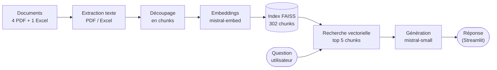
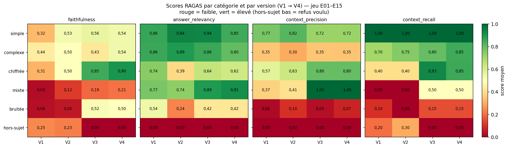
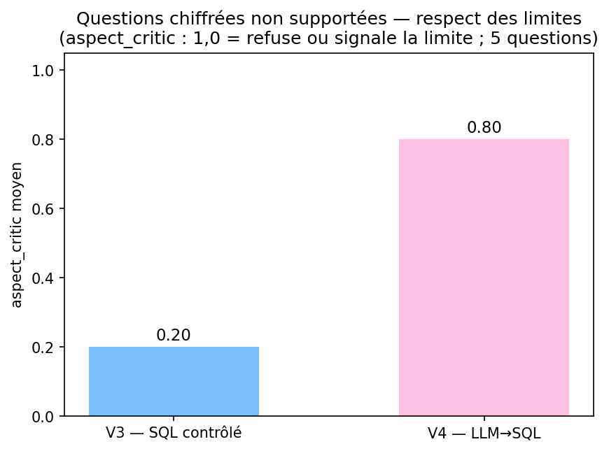
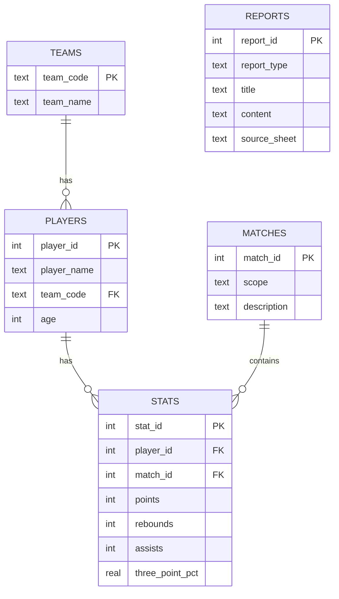

# Rapport de mise en place et d'évaluation du système RAG

## Sommaire

- [Résumé exécutif](#résumé-exécutif)
1. [Contexte du projet](#1-contexte-du-projet)
2. [Dataset utilisé](#2-dataset-utilisé)
3. [Méthodologie d'évaluation](#3-méthodologie-dévaluation)
   - [Jeu de questions](#jeu-de-questions)
   - [Métriques](#métriques)
   - [Tests de robustesse](#tests-de-robustesse)
4. [RAG v1 — baseline](#4-rag-v1--baseline)
   - [Audit du prototype initial](#audit-du-prototype-initial)
   - [Évaluation RAGAS](#évaluation-ragas)
5. [RAG v2 — contrôlé](#5-rag-v2--contrôlé)
   - [Contrôle des données](#contrôle-des-données)
      - [Pydantic](#pydantic)
      - [Pydantic AI](#pydantic-ai)
      - [Logfire](#logfire)
   - [Évaluation](#évaluation-de-rag-v2)
      - [Comparaison avant / après](#comparaison-avant--après)
      - [Robustesse des résultats](#robustesse-des-résultats)
      - [Limites restantes](#limites-restantes)
6. [RAG v3 — SQL contrôlé (benchmark)](#6-rag-v3--sql-contrôlé-benchmark)
   - [Architecture générale](#architecture-générale)
   - [Données structurées et ingestion](#données-structurées-et-ingestion)
   - [Routage et sécurité](#routage-et-sécurité)
   - [Résultats du benchmark contrôlé](#résultats-du-benchmark-contrôlé)
7. [RAG v4 — agent LLM→SQL (version finale)](#7-rag-v4--agent-llmsql-version-finale)
   - [Principe : agent + SQL Tool](#principe--agent--sql-tool)
   - [Garde-fous](#garde-fous)
   - [Résultats sur E01–E15](#résultats-sur-e01e15)
   - [Questions chiffrées non supportées](#questions-chiffrées-non-supportées)
   - [Figures de synthèse (V1 → V4)](#figures-de-synthèse-v1--v4)
8. [Limites, biais et risques](#8-limites-biais-et-risques)
9. [Conclusion](#9-conclusion)
10. [Annexes](#10-annexes)
    - [Annexe A — schéma SQLite détaillé](#annexe-a--schéma-sqlite-détaillé)
    - [Annexe B — exemple d'appel du SQL Tool](#annexe-b--exemple-dappel-du-sql-tool)
    - [Annexe C — exemples de requêtes SQL](#annexe-c--exemples-de-requêtes-sql)
    - [Annexe D — détail chiffré V3 vs V4 (route SQL)](#annexe-d--détail-chiffré-v3-vs-v4-route-sql)
    - [Annexe E — exemples de réponses](#annexe-e--exemples-de-réponses)

---

## Résumé exécutif

Ce projet améliore un assistant NBA qui répond à partir de documents (discussions Reddit) et de statistiques de saison (fichier Excel). Le travail s'est fait en quatre versions, chacune corrigeant la limite de la précédente :

- **V1 — baseline RAG** : le système retrouve des passages puis rédige. Il marche, mais reste fragile, surtout sur les **questions chiffrées** (il reformule un extrait au lieu de calculer) : `faithfulness` ≈ 0,25.
- **V2 — RAG contrôlé** : ajout de Pydantic, Pydantic AI et Logfire pour structurer et tracer la génération. Les réponses sont mieux ancrées dans les sources (`faithfulness` ≈ 0,36).
- **V3 — SQL contrôlé (benchmark)** : les statistiques sont chargées dans une base SQLite interrogée par un **SQL Tool en lecture seule**, avec des requêtes issues d'un mapping figé. C'est un **benchmark sécurisé et stable**, pas la version finale ; il fait nettement progresser les questions chiffrées (`faithfulness` ≈ 0,51).
- **V4 — agent LLM→SQL (version finale)** : le LLM détecte la question chiffrée, propose une requête SQL, appelle le SQL Tool, puis synthétise. C'est l'approche « agent + Tool » de l'énoncé, retenue comme version finale.

**Résultat clé** : sur le jeu figé E01–E15, V4 est **au moins à parité** avec le benchmark V3 (`faithfulness` ≈ 0,54). Sur des questions chiffrées **impossibles** avec les données actuelles (ex. « 5 derniers matchs »), V4 est nettement meilleur : il **refuse honnêtement** au lieu de répondre à côté (`aspect_critic` 0,80 contre 0,20). Dans les deux modes, aucune statistique n'est inventée : toute requête reste validée et exécutée en lecture seule.

**Limite principale** : les données sont agrégées sur la saison (pas de match par match). Les questions qui demandent ce détail (5 derniers matchs, domicile/extérieur, évolution) doivent être refusées — ce que V4 fait mieux que le benchmark.

---

## 1. Contexte du projet

L'application est un assistant conversationnel sur la NBA. Elle permet d'interroger des discussions de fans, des rapports et des statistiques de saison.

Elle repose sur un pipeline RAG (*Retrieval-Augmented Generation*). Avant de répondre, le système cherche des passages pertinents dans les documents. Il demande ensuite à un modèle de langage de rédiger une réponse à partir de ces passages.

Les sources sont mixtes : quatre PDF de discussions Reddit et un fichier Excel de statistiques de saison (`regular NBA.xlsx`).

Le travail s'organise autour d'une progression en quatre versions :

1. **RAG v1 — baseline** : auditer le prototype initial et mesurer ses limites avec RAGAS ;
2. **RAG v2 — contrôlé** : sécuriser le pipeline avec Pydantic, Pydantic AI et Logfire, puis vérifier si l'ancrage des réponses progresse ;
3. **RAG v3 — SQL contrôlé (benchmark)** : ajouter une couche SQLite et un routage RAG / SQL / hybride / refus, avec des requêtes SQL **prédéfinies** — un benchmark stable et sécurisé pour les questions chiffrées ;
4. **RAG v4 — agent LLM→SQL (version finale)** : laisser le LLM détecter la question chiffrée, proposer une requête SQL, appeler le SQL Tool en lecture seule, puis synthétiser la réponse. C'est la version qui correspond le mieux à l'attendu « agent + Tool » de l'énoncé, et celle retenue pour ce projet.

Pour simplifier la lecture, les versions sont nommées ainsi :

| Nom | Description | Tag Git |
|---|---|---|
| **RAG v1 — baseline** | pipeline RAG initial | `rag-v1-baseline` |
| **RAG v2 — contrôlé** | ajout de Pydantic, Pydantic AI et Logfire | `rag-v2-controlled` |
| **RAG v3 — SQL contrôlé (benchmark)** | SQLite + SQL Tool, requêtes prédéfinies (benchmark sécurisé) | `rag-v3-sql-hybrid` |
| **RAG v4 — agent LLM→SQL (version finale)** | le LLM génère la requête, exécutée en lecture seule par le SQL Tool | `rag-v4-llm-sql-final` |


---

## 2. Dataset utilisé

Le corpus combine deux types de données complémentaires :

- **PDF Reddit** : quatre PDF de discussions de fans NBA, issus de captures d'écran. Le texte extrait peut contenir du bruit lié aux captures / OCR. Ces documents servent aux questions d'opinion, de synthèse et de discussion ;
- **fichier Excel NBA** : statistiques agrégées de saison. Il contient plusieurs feuilles :
  - `Données NBA` : table principale, avec 569 joueurs et 45 colonnes de statistiques joueur-saison (`Player`, `Team`, `Age`, `GP`, `PTS`, `REB`, `AST`, `3P%`, `TS%`, `USG%`, `PIE`…). C'est la source des requêtes chiffrées ;
  - `Equipe` : référentiel des 30 équipes, avec le code à trois lettres (`BOS`, `DEN`, `LAL`…) et le nom complet ;
  - `Analyse` : synthèses déjà présentes dans le fichier, notamment le nombre de joueurs et le total de points par équipe, puis un top 15 des joueurs au nombre de points. Ces blocs sont conservés comme texte d'analyse ;
  - `Analyse Vide` : modèle de feuille d'analyse partiellement vide, conservé dans le fichier mais non utilisé comme source principale ;
  - `Dictionnaire des données` : définition des colonnes statistiques (`GP`, `PTS`, `FG%`, `OREB`, `DREB`, `AST`, `TOV`, `PIE`, etc.).

> Le fichier Excel ne contient pas de matchs individuels : les statistiques sont agrégées au niveau joueur-saison. 
> Les questions sur les 5 derniers matchs ou le découpage domicile / extérieur doivent donc être refusées ou reformulées avec une alternative sur la saison. 


---

## 3. Méthodologie d'évaluation

Pour mesurer le comportement du prototype, une évaluation automatique a été mise en place avec RAGAS. Le script `scripts/evaluate_ragas.py` exécute le vrai pipeline de l'application sur chaque question, puis calcule les métriques. Les résultats sont écrits dans `evaluation/results/`.

### Jeu de questions

Un jeu de 15 questions est défini dans `evaluation/evaluation_questions.csv`. Chaque ligne contient la question, sa catégorie, le comportement attendu et une réponse de référence courte. Un champ `requires_sql_future` marque les questions qui demandent un calcul.

Les catégories couvrent des cas variés : simple (2), complexe (2), chiffrée (5), mixte (2), bruitée (2), hors sujet (2). Une fois la première évaluation calculée, le jeu de questions n'est plus modifié.

Des exemples par catégorie :

| Catégorie | Exemple | Ce que le cas teste |
|---|---|---|
| simple | « Pour quelle équipe joue Nikola Jokić d'après les données de la saison ? » | Lecture directe d'une information présente dans les contextes. |
| complexe | « D'après les discussions Reddit, quels arguments pour et contre le tournoi play-in les fans avancent-ils ? » | Synthèse de plusieurs passages, sur des chunks bruités. |
| chiffrée | « Quel joueur a le meilleur pourcentage à 3 points (3P%) cette saison ? » | Calcul d'un maximum — cas d'hallucination observé à l'audit. |
| mixte | « Quel joueur a délivré le plus de passes décisives, et qu'est-ce que cela révèle de son rôle ? » | Un chiffre à trouver, puis une interprétation. |
| bruitée | « kl vs okc stts rebnd lst 5 gm?? » | Robustesse face à une question mal écrite. |
| hors sujet | « Quelle est la recette de la ratatouille ? » | Garde-fou : le refus est attendu. |

### Métriques

RAGAS note la qualité des réponses d'un RAG, chaque métrique entre 0 et 1. Pour fixer les idées, prenons la question « Qui a le meilleur pourcentage à 3 points ? » :

- **faithfulness (fidélité)** : la réponse reste-t-elle strictement appuyée sur les sources ? C'est la métrique principale contre les hallucinations. Donner un nom ou un chiffre absent des sources la fait chuter.
- **answer_relevancy (pertinence)** : la réponse répond-elle vraiment à la question posée ? Une réponse peut être fidèle mais inutile si elle parle d'autre chose.
- **context_precision (précision du contexte)** : parmi les passages récupérés, combien sont vraiment utiles ? Une précision faible = beaucoup de bruit récupéré.
- **context_recall (rappel du contexte)** : parmi les informations nécessaires, combien ont bien été retrouvées ? Un rappel faible = des informations importantes manquent.

> Le juge qui attribue ces scores est lui-même un modèle de langage (`mistral-large-latest`). Ses scores varient d'un run à l'autre, même sans changer le pipeline. 

### Tests de robustesse

En plus des scores RAGAS, des tests automatiques (sans appel API) vérifient que le système réagit correctement aux cas problématiques, chacun rattaché à un risque métier :

- **questions bruitées** (fautes de frappe, abréviations) : la catégorie `bruitee` du jeu figé vérifie qu'une question mal écrite reste comprise (`evaluation/evaluation_questions.csv`) ;
- **questions hors sujet** : un refus poli est attendu plutôt qu'une réponse hasardeuse (`tests/test_router.py`) ;
- **SQL dangereux ou en écriture** (`DROP`, `UPDATE`, requêtes multiples…) : refusé avant toute exécution (`tests/test_sql_tool.py`, `tests/test_llm_sql_generator.py`) ;
- **données absentes** (domicile/extérieur, 5 derniers matchs) : l'assistant signale la limite et propose une alternative sur la saison au lieu d'inventer (`tests/test_router.py`) ;
- **homonymes / formulations ambiguës** : un nom de famille ambigu n'est pas résolu au hasard (`tests/test_router.py`).

Le jeu étendu `evaluation/evaluation_questions_sql_extended.csv` complète ces cas pour l'analyse plus fine des modes SQL.

---

## 4. RAG v1 — baseline

### Audit du prototype initial

L'audit complet est disponible dans `docs/audit_initial.md` et `notebooks/audit.ipynb`.

#### Fonctionnement du prototype

Le prototype suit ce flux :



Étapes :

- **Extraction** : le texte est extrait des PDF Reddit et du fichier Excel, avec un bruit possible lié aux captures / OCR.
- **Découpage en chunks** : les documents sont découpés en morceaux d'environ 1 500 caractères, plus faciles à rechercher.
- **Embeddings** : chaque chunk est transformé en vecteur numérique qui représente son sens (modèle `mistral-embed`).
- **Index FAISS** : les vecteurs sont stockés dans un index de recherche rapide.
- **Recherche vectorielle** : pour chaque question, les 5 chunks les plus proches sont récupérés.
- **Génération** : un modèle Mistral (`mistral-small-latest`) rédige la réponse à partir de la question et des chunks.

L'interface est une application Streamlit (`MistralChat.py`). 

#### Ce qui fonctionne

- le pipeline tourne de bout en bout ;
- l'index FAISS est construit (302 chunks à partir de 5 documents) ;
- la recherche vectorielle retourne des contextes ;
- l'application répond aux questions.

#### Limites observées

- les réponses peuvent être peu ancrées dans les sources : le prompt initial (« animer le débat ») n'oblige pas le modèle à se limiter aux contextes ;
- FAISS retrouve du texte proche, mais ne calcule rien : il ne sait pas trouver un maximum dans le fichier Excel ;
- le texte extrait des PDF Reddit peut contenir du bruit lié aux captures / OCR ;
- les questions hors sujet ne sont pas toujours refusées (testé avec une recette de cuisine : le modèle répond souvent).

#### Exemple de limite

À la question « quel joueur a le meilleur pourcentage à 3 points ? », le modèle peut répondre **Shai Gilgeous-Alexander — 37,5 %**. Pourtant, un extrait récupéré contient déjà **Nikola Jokić — 41,7 %**.

Le système reformule un passage. Il ne calcule pas le maximum de la colonne. Le RAG seul ne suffit donc pas pour les questions de calcul.


### Évaluation RAGAS

Cette première mesure sert de point de départ : elle évalue le prototype tel qu'il existe au départ, sans modification du prompt, du modèle ou de la récupération FAISS.

| Métrique | Score | Lecture |
|---|---:|---|
| `faithfulness` | 0,2512 | Risque d'hallucination élevé : le modèle ajoute ou reformule trop souvent au-delà des sources. |
| `answer_relevancy` | 0,5760 | Pertinence correcte : la réponse semble souvent répondre à la question, même quand elle est mal justifiée. |
| `context_precision` | 0,3622 | Précision faible côté récupération : une partie des contextes récupérés n'aide pas vraiment à répondre. |
| `context_recall` | 0,4000 | Rappel faible côté récupération : les contextes ne couvrent pas toujours toutes les informations attendues. |

> Ces chiffres sont issus d'un run unique du prototype. Les figures de synthèse (§7) utilisent, elles, la moyenne de plusieurs runs : de petits écarts entre les deux sont normaux (le juge RAGAS est lui-même un LLM, un peu variable).

Le résultat principal est la faiblesse de la `faithfulness`. Le prototype répond, mais il s'autorise trop souvent à compléter ou reformuler au-delà des sources. Cette limite est particulièrement visible sur les questions chiffrées : FAISS peut retrouver un extrait proche, mais il ne sait pas calculer un maximum, un classement ou une moyenne.

Cette baseline fixe donc deux objectifs pour les versions suivantes : mieux encadrer la génération, puis ajouter une brique structurée pour les calculs sur les statistiques NBA.

#### Fidèle, pertinent, correct : trois cas concrets

Sur « Qui a le meilleur pourcentage à 3 points ? », trois réponses possibles montrent ce que mesurent les métriques :

- *Fidèle mais peu pertinente* : « Les fans discutent beaucoup du tir à 3 points. » — appuyée sur un extrait réel, mais elle ne répond pas (fidélité ↑, pertinence ↓).
- *Pertinente mais infidèle* : « Steve Nash, 49 %. » — répond bien à la question, mais ce joueur n'est même pas dans les données : c'est une hallucination (pertinence ↑, fidélité ↓).
- *Correcte* (visée par V3 et V4) : « Seth Curry, 45,6 % (au moins 100 tentatives). » — exacte **et** appuyée sur la base (les deux ↑).

---

## 5. RAG v2 — contrôlé

Trois briques sont ajoutées, sans changer le modèle de génération ni la récupération FAISS : 
- validation des données avec Pydantic, 
- génération structurée avec Pydantic AI, 
- traçage optionnel avec Logfire.

### Contrôle des données

#### Pydantic

>Pydantic est une librairie de validation : on décrit la forme attendue d'un objet, elle vérifie que les données la respectent.

Les modèles de `utils/schemas.py` valident les objets du pipeline :

- les **documents** chargés (texte non vide, source connue) ;
- les **chunks** indexés (identifiant, texte, métadonnées) ;
- les **contextes récupérés** (texte, score, source) ;
- la **réponse finale** (réponse non vide, contextes utilisés).

Les erreurs de structure sont ainsi détectées tôt, au lieu de se propager dans le pipeline.

#### Pydantic AI

> Pydantic AI encadre les appels au modèle : on déclare le type de sortie attendu, et la sortie est validée avec Pydantic. 
> La génération est centralisée sous forme d'un agent Pydantic AI.

L'agent utilise Mistral (`mistral-small-latest`, température 0,1, même prompt que le prototype), reçoit la question et les contextes FAISS, et produit une sortie typée `RagAnswerOutput` (réponse non vide).

Point important : `MistralChat.py` (l'application) et `scripts/evaluate_ragas.py` (l'évaluation) utilisent **le même agent**. L'évaluation mesure donc le même chemin de génération que l'application.

Pydantic AI ne rend pas le modèle meilleur en soi. Il rend la génération plus structurée : sortie au format garanti, validation systématique, code unique. Si le modèle renvoie une réponse vide, l'agent lève une erreur ; le script d'évaluation gère ce cas avec quelques ré-essais.

#### Logfire

> Logfire est un outil de traçage : il enregistre ce qui se passe pendant l'exécution et l'affiche dans une interface web.

Son intégration est optionnelle et non bloquante :

- **sans token** (clé d'accès), l'application fonctionne normalement, rien n'est envoyé ;
- **avec token**, les étapes clés sont tracées : recherche vectorielle, génération (un span par question, appels Mistral inclus), évaluation RAGAS.

Cela aide à comprendre le comportement du pipeline : temps passé par étape, erreurs API, contextes récupérés.


---

### Évaluation de RAG v2

Après le passage à `RAG v2 — contrôlé`, l'évaluation a été relancée : mêmes questions, mêmes métriques, même juge. La génération passe par l'agent Pydantic AI ; la récupération FAISS est inchangée.

#### Comparaison avant / après

| Métrique | Avant | Après | Évolution | Lecture |
|---|---:|---:|---:|---|
| `faithfulness` | 0,2512 | 0,3534 | +0,1022 | Le risque d'hallucination baisse : les réponses sont mieux alignées avec les contextes. |
| `answer_relevancy` | 0,5760 | 0,5520 | −0,0240 | La pertinence directe baisse légèrement : le modèle répond de façon un peu moins libre, mais plus contrôlée. |
| `context_precision` | 0,3622 | 0,3622 | 0,0000 | La précision de récupération ne change pas, ce qui est attendu car FAISS est inchangé. |
| `context_recall` | 0,4000 | 0,4333 | +0,0333 | Le rappel progresse légèrement, mais l'effet reste limité : la récupération n'est pas la brique modifiée. |

L'amélioration vient donc surtout de la génération : le même contexte est utilisé, mais la réponse est mieux encadrée.

Le juge varie d'un run à l'autre. Pour éviter de conclure sur un seul score, la sous-section suivante répète l'évaluation plusieurs fois.

#### Robustesse des résultats

L'évaluation a été relancée 5 fois pour chaque version du pipeline, dans les mêmes conditions. Le tableau ci-dessous se concentre sur la `faithfulness`, car c'est la métrique qui mesure le mieux le risque d'hallucination.

| Indicateur | Avant (ancien pipeline) | Après (agent Pydantic AI) | Lecture |
|---|---:|---:|---|
| run 0 | 0,251 | 0,353 | Le premier run retrouve le gain observé dans le tableau précédent. |
| run 1 | 0,238 | 0,334 | Le score reste supérieur après passage par l'agent. |
| run 2 | 0,188 | 0,393 | Le plus mauvais run de l'ancien pipeline reste loin du niveau atteint après correction. |
| run 3 | 0,289 | 0,391 | Même le meilleur score de l'ancien pipeline reste sous les meilleurs scores de RAG v2. |
| run 4 | 0,278 | 0,310 | Le gain existe encore, même sur le run le moins favorable après correction. |
| **Moyenne** | **0,249** | **0,356** | Gain moyen d'environ +0,10 : le risque d'hallucination baisse de façon répétée. |
| **Étendue** | 0,188–0,289 | 0,310–0,393 | Les deux plages ne se recouvrent pas : l'effet dépasse la simple variation du juge. |
| **Écart-type** | 0,040 | 0,036 | La variabilité est comparable avant et après ; le gain ne vient donc pas d'un run isolé. |

> La hausse de `faithfulness` apparaît donc comme une **tendance nette** : les réponses sont mieux encadrées avec l'agent Pydantic AI. En contrepartie, l'`answer_relevancy` moyenne baisse (≈ 0,50 contre ≈ 0,65) : les réponses sont plus proches des sources, mais parfois moins directes. Avec 5 + 5 runs, l'interprétation reste prudente : le signal est clair, sans être une preuve absolue.

#### Limites restantes

- le RAG reste fragile pour les questions qui demandent un calcul exact (maximum, moyenne, classement) ;
- FAISS cherche du texte proche, il ne calcule pas : les données Excel demandent une brique structurée ;
- les PDF OCR peuvent contenir du bruit ;
- les questions hors sujet ne sont pas systématiquement refusées.

---

## 6. RAG v3 — SQL contrôlé (benchmark)

Cette version complète le RAG texte avec un accès structuré aux statistiques. Le fichier Excel est chargé dans une base SQLite, interrogée avec un SQL Tool LangChain en lecture seule. Le routeur oriente chaque question vers le bon traitement : RAG texte, SQL, réponse hybride ou refus hors périmètre.

Ici, les requêtes SQL sont **prédéfinies** (mapping figé à colonnes sur liste blanche, aucun SQL écrit par le LLM). Ce mode `controlled` n'est pas la version finale du projet : il sert de **benchmark sécurisé et déterministe** — un point de comparaison stable pour la version finale (RAG v4 — agent LLM→SQL, §7). Il établit aussi la brique réutilisée par v4 : le SQL Tool en lecture seule.

### Architecture générale

L'architecture se lit en deux temps : la préparation des données (hors ligne), puis le traitement d'une question.

**Préparation des données.** Les documents texte (PDF Reddit) sont découpés, vectorisés (`mistral-embed`) et stockés dans FAISS. En parallèle, le fichier Excel est chargé — validé par Pydantic — dans une base SQLite dédiée aux statistiques.


**Traitement d'une question.** Le routeur choisit, par règles de mots-clés, l'une des quatre routes, et chacune produit la réponse affichée dans Streamlit. Les questions documentaires passent par FAISS, les questions chiffrées par SQLite en lecture seule, les questions mixtes par les deux (chiffre vérifié + rédaction), et les questions hors NBA reçoivent un refus poli.


### Données structurées et ingestion

Le passage à SQL ne transforme pas toute l'application en base de données. Il ajoute seulement une couche structurée pour les statistiques qui demandent un calcul exact. Cinq tables structurent ces données :

- `teams` : référentiel des équipes (justifié par la feuille `Equipe`) ;
- `players` : les joueurs, rattachés à leur équipe ;
- `matches` : table minimaliste — elle représente le périmètre de la saison régulière, sans inventer de matchs ;
- `stats` : les statistiques de saison par joueur ;
- `reports` : les blocs d'analyse textuels de la feuille `Analyse`.

Le schéma détaillé de la base est donné en [annexe A](#annexe-a--schéma-sqlite-détaillé). Dans le corps du rapport, l'important est surtout le choix de séparation : référentiel équipes, référentiel joueurs, statistiques chiffrées et blocs d'analyse textuels.

Trois points repérés à l'analyse et traités dès l'import :

- la colonne `3PM` est interprétée par Excel comme une heure (`15:00:00`) : elle est renommée à la lecture ;
- les classements par pourcentage demandent un filtre de volume (au moins 100 tentatives), sinon un joueur à 1 tir réussi sur 1 apparaît à 100 % ;
- les pourcentages sont stockés tels quels (`37.5` pour 37,5 %), sans conversion.

#### Ingestion et contrôles

Le pipeline est : `Excel → validation Pydantic → SQLite → requêtes de contrôle`. 

Chaque ligne est validée avant insertion (`utils/sql/schemas.py`). La base est générée localement :

```bash
poetry run python scripts/load_excel_to_db.py
```

**Contrôles sur la base générée :** 
- 30 équipes, 
- 569 joueurs, 
- 569 lignes de statistiques, 
- 1 ligne `matches`, 
- 2 rapports ; 
- 0 ligne orpheline, 
- 0 violation de clé étrangère.
- Meilleur marqueur : Shai Gilgeous-Alexander (2 485 points). 
- Meilleur 3P% avec au moins 100 tentatives : Seth Curry (45,6 %).

### Routage et sécurité

#### SQL Tool LangChain en lecture seule

Le module `utils/sql/sql_tool.py` expose l'outil qui interroge cette base, en deux niveaux :

- une fonction interne sécurisée, `run_read_only_query()`, qui contrôle puis exécute la requête ;
- un tool LangChain (`StructuredTool`), nommé `nba_sql_query`, avec un schéma d'entrée Pydantic (`query`, `params`, `limit`) branché sur l'assistant.

Règles de sécurité (lecture seule stricte) :

- seules les requêtes `SELECT` (ou `WITH`) sont acceptées ;
- les mots-clés d'écriture sont refusés (`INSERT`, `UPDATE`, `DELETE`, `DROP`, `PRAGMA`…) ;
- une seule requête à la fois : `SELECT …; DROP TABLE …` est refusé ;
- le nombre de lignes retournées est plafonné (20 par défaut) ;
- la connexion SQLite est ouverte en mode lecture seule : même une requête qui passerait les filtres ne pourrait pas écrire.

Exemples de questions qui passeront par SQL :

- « Quel joueur a marqué le plus de points ? »
- « Qui a le meilleur pourcentage à 3 points avec au moins 100 tentatives ? »
- « Combien de joueurs par équipe ? »
- « Quelles sont les stats de Nikola Jokić ? »

Les questions sur les documents (« que disent les fans sur les Lakers ? ») restent côté RAG texte.

Le tool renvoie des données structurées ; l'assistant rédige ensuite la réponse. Un exemple d'appel est donné en [annexe B](#annexe-b--exemple-dappel-du-sql-tool).

Le module est couvert par 20 tests sans appel API (`tests/test_sql_tool.py`) : requêtes valides, refus d'écriture, plafond de lignes, erreurs propres, appel du tool via `.invoke(...)`.

#### Routage intégré : l'assistant choisit son chemin

Le module `utils/router.py` classe chaque question vers quatre chemins, utilisés à la fois par l'application et par l'évaluation :

| Route | Cas | Traitement |
|---|---|---|
| `rag` | documents, opinions, discussions Reddit | FAISS + génération |
| `sql` | question chiffrée | requête contrôlée via le SQL Tool |
| `hybrid` | chiffre + interprétation | SQL d'abord, puis rédaction LLM |
| `out_of_scope` | hors NBA / hors sources | refus poli, aucun appel externe |

Pour les questions chiffrées, le mode contrôlé (`controlled`, le benchmark de cette version) s'appuie sur des cas connus : classement, statistique joueur, filtre équipe ou seuil numérique. Une requête SQL prédéfinie est ensuite exécutée en lecture seule par le SQL Tool. La version finale (v4, §7) lèvera la contrainte des cas prédéfinis.

Si la donnée demandée n'existe pas dans la base, le système refuse de calculer et explique la limite. L'application et l'évaluation utilisent la même fonction `answer_question()`, donc les scores RAGAS mesurent le même comportement que l'interface.

Le jeu figé E01–E15 reste la référence officielle. Le jeu étendu SQL sert seulement à analyser plus finement les cas chiffrés.

### Résultats du benchmark contrôlé

#### Avant / après routage
Trois conditions sont comparées sur le jeu figé E01–E15, avec les mêmes métriques et le même juge que les évaluations précédentes : RAG texte seul avant routage SQL, routage avec hybride `sql_only`, routage avec hybride `sql_with_rag_context`.

Comme le juge RAGAS varie d'un run à l'autre, chaque condition a été relancée 5 fois. Le tableau ci-dessous présente les scores moyens.

| Condition | faithfulness | answer_relevancy | context_precision | context_recall | Lecture |
|---|---:|---:|---:|---:|---|
| RAG texte seul (avant routage SQL) | 0,356 | 0,504 | 0,423 | 0,407 | Point de comparaison : le RAG seul reste fragile sur les questions chiffrées. |
| Routage · hybride `sql_only` | 0,509 | 0,629 | 0,547 | 0,638 | Meilleure variante contrôlée : les réponses chiffrées s'appuient sur un fait SQL exact. |
| Routage · hybride `sql_with_rag_context` | 0,505 | 0,637 | 0,535 | 0,624 | Variante testée, sans gain clair par rapport à `sql_only`. |

Le routage améliore les quatre métriques, surtout la pertinence (`answer_relevancy` 0,50 → 0,63–0,64) et la récupération de contexte. Le gain vient principalement des questions chiffrées : elles ne dépendent plus d'extraits approximatifs, mais d'une requête SQL.

Lecture par catégorie (`faithfulness`) :

| Catégorie | RAG texte seul | Routage SQL / hybride | Lecture |
|---|---:|---:|---|
| Chiffrées | 0,50 | 0,84–0,85 | Gain attendu : le SQL renvoie la valeur exacte là où le RAG approximait ou hallucinait. |
| Bruitées | 0,05 | 0,50–0,52 | Les formulations imparfaites comme « meilleur tireur a 3pts cette saion?? » sont mieux reconnues comme des questions chiffrées. |
| Mixtes | 0,12 | 0,16–0,19 | Gain limité : la partie interprétative reste difficile à justifier avec des citations exactes. |
| Hors-sujet | 0,23 | 0,00 | Régression apparente : le refus poli est voulu, mais RAGAS le note mal car il ne cite aucun contexte. |

La distribution des routes sur E01–E15 confirme le comportement attendu : 5 `rag`, 6 `sql`, 2 `hybrid`, 2 `out_of_scope`.

#### Variantes contrôlées (note)

Deux variantes du mode contrôlé ont été regardées sur les questions `hybrid` : `sql_only` (rédaction à partir du seul chiffre SQL) et `sql_with_rag_context` (quelques extraits FAISS en plus, les chiffres SQL faisant foi). L'écart entre les deux reste dans le bruit du juge RAGAS ; `sql_only` est gardé comme réglage par défaut du benchmark (plus simple et plus stable), `sql_with_rag_context` reste activable par configuration (`HYBRID_MODE=sql_with_rag_context`). Cette comparaison interne sert seulement à cadrer le benchmark, pas à désigner une version finale.

#### Limites du routage contrôlé

- routage par règles : robuste sur le jeu testé, mais une question très déformée peut être mal classée (E12 reste en `rag`) ;
- en mode contrôlé, la couverture SQL est **bornée aux requêtes prédéfinies** : chaque nouveau type de question chiffrée demande d'écrire une règle. C'est précisément la limite que lève la version finale (RAG v4) ;
- RAGAS juge mal deux familles de réponses correctes : les refus (hors-sujet, note 0 par construction) et les réponses interprétatives des questions mixtes ; le comparatif chiffré est donc complété d'une lecture qualitative.

## 7. RAG v4 — agent LLM→SQL (version finale)

Le mode contrôlé (v3) répond bien aux questions prévues, mais il faut écrire une règle pour chaque nouveau cas. La version finale change d'approche : c'est **le LLM qui interprète la question chiffrée, propose une requête SQL, appelle le SQL Tool, puis synthétise la réponse**. C'est l'attendu « agent + Tool » de l'énoncé de l'étape 2. C'est désormais le **mode par défaut** (`SQL_GENERATION_MODE=llm`) ; le mode contrôlé reste disponible comme benchmark (`SQL_GENERATION_MODE=controlled`).

### Principe : agent + SQL Tool

Le pipeline (`utils/sql/llm_sql_generator.py` puis `utils/sql/llm_sql_pipeline.py`) enchaîne trois étapes :

1. **Décision** : un agent Pydantic AI reçoit la question et le schéma de la base, et renvoie une sortie **typée** (`LlmSqlDecision` : `should_query`, `sql`, `reason`, `expected_result_type`). S'il juge la question non couverte, il répond `should_query=false` avec un motif.
2. **Validation** : la requête proposée est revalidée statiquement (lecture seule) **avant toute exécution** — le même contrôle que le mode contrôlé.
3. **Exécution + synthèse** : la requête validée est exécutée par le SQL Tool sécurisé (lecture seule, plafond de lignes), puis la réponse est mise en forme en français à partir des seules lignes retournées.

Le LLM ne touche jamais la base : il ne fait que **proposer** un texte de requête. Toute exécution passe par le SQL Tool.

### Garde-fous

La souplesse du LLM est entièrement encadrée — la confiance dans le texte généré est nulle :

- **lecture seule stricte** : `SELECT`/`WITH` uniquement, une seule requête, mots-clés d'écriture/administration refusés (`INSERT`, `UPDATE`, `DROP`, `PRAGMA`…) ;
- **connexion en `mode=ro`** : même une requête qui passerait les filtres ne pourrait pas écrire ;
- **refus honnête** si la donnée n'existe pas (`should_query=false`) — aucun chiffre inventé ;
- **colonnes / tables inexistantes bloquées** : une requête qui invente une colonne échoue à l'exécution et l'assistant se rabat sur un refus (observé : le LLM a généré `rebounds_per_game`, colonne absente → `no such column` → refus, sans afficher de chiffre) ;
- **plafond de lignes** imposé à l'exécution, même si le LLM l'oublie.

Le module est couvert par des tests sans appel API (`tests/test_llm_sql_generator.py`).

### Résultats sur E01–E15

Sur la route `sql` du jeu figé (moyenne ± écart-type sur 5 runs), le LLM→SQL atteint **au moins la parité** avec le benchmark contrôlé, avec un léger avantage en fidélité :


Globalement sur les 15 questions, V4 est au niveau de V3 (`faithfulness` ≈ 0,54 contre 0,51 ; autres métriques dans le bruit du juge). Le détail chiffré est en [annexe D](#annexe-d--détail-chiffré-v3-vs-v4-route-sql). Le contrôlé reste un peu plus **stable** (écart-type plus faible) : c'est la contrepartie attendue d'un mapping figé.

#### Lecture par catégorie (V1 → V4)

Détail par type de question (moyenne sur 5 runs, jeu figé E01–E15). Deux catégories se lisent à part : **hors-sujet** est noté 0 dès qu'il y a routage (le refus est correct, mais RAGAS le note mal car aucun contexte n'est cité), et **bruitée** part de très bas en V1/V2.



Lecture par métrique :

- **faithfulness** : gain concentré sur les chiffrées (0,31 → 0,90) et les bruitées à intention chiffrée ; V4 ≥ V3 sur chiffrées et complexes.
- **answer_relevancy** : élevée et stable sur simple/complexe ; V3/V4 redressent les mixtes ; la baisse en V2 sur les chiffrées (réponses plus ancrées, moins directes) est rattrapée par le SQL.
- **context_precision** : bond sur les mixtes (0,37 → 1,00) et les chiffrées (→ 0,80) grâce au contexte SQL exact.
- **context_recall** : progression sur les chiffrées (0,40 → 0,93/0,85) et les mixtes (0 → 0,50).

En résumé, les gains de V3 et V4 par rapport au RAG seul se concentrent là où le RAG échouait (chiffrées, mixtes, bruitées à intention chiffrée), tandis que les questions documentaires (simple, complexe) restent à un bon niveau et que les hors-sujet sont volontairement refusées.

### Questions chiffrées non supportées

Une évaluation complémentaire cible cinq questions chiffrées **impossibles avec le schéma actuel** (statistiques de saison, sans match par match) : meilleur 3P% sur les 5 derniers matchs ; rebonds domicile/extérieur ; évolution de Nikola Jokić sur ses 5 derniers matchs ; rebonds par match Jokić / LeBron ; joueur qui a le plus progressé. Le détail figure dans `evaluation/results/sql_modes_unsupported_analysis.md`.

Exemple sur « Quel joueur a le meilleur pourcentage à 3 points sur ses 5 derniers matchs ? » :

- **V3 contrôlé** répond à côté, sur la saison : « Meilleurs tireurs à 3 points (min. 100 tentatives) : 1. Seth Curry 45,6 %… » — des chiffres réels, mais pas la question posée.
- **V4 LLM→SQL** refuse honnêtement : « Cette question chiffrée n'a pas pu être traitée de façon fiable : la base ne contient pas de données match par match… »

Résultat (lecture métier + RAGAS `aspect_critic`) :

| Indicateur | V3 — SQL contrôlé | V4 — LLM→SQL |
|---|---|---|
| Réponses à côté (question impossible traitée comme une autre) | **3 / 5** | 0 / 5 |
| Refus correct ou erreur contenue | 1 / 5 | **4 / 5** |
| Chiffre inventé | 0 / 5 | 0 / 5 |
| `aspect_critic` (respect des limites, 1,0 = idéal) | **0,20** | **0,80** |



Insight important sur les métriques : les **4 métriques RAGAS classiques peuvent récompenser le contrôlé** parce qu'il répond avec des chiffres réels — même quand il répond à côté — alors qu'elles **pénalisent un refus** (pas de contexte ni de réponse à juger). Elles mesurent « la réponse est-elle ancrée ? », pas « fallait-il répondre ? ». Il faut donc les compléter par `aspect_critic` et une lecture métier. Conclusion de cette comparaison : le risque principal du contrôlé n'est **pas l'hallucination, mais la réponse à côté** ; le LLM→SQL, encadré par le SQL Tool en lecture seule, détecte mieux les limites du schéma.

### Figures de synthèse (V1 → V4)

Les figures ci-dessous consolident la progression. Elles sont régénérées **sans appel API** (`poetry run python scripts/make_report_figures.py`), chaque version étant moyennée sur ses runs de variance (barres d'erreur = écart-type).

**Scores RAGAS par version (V1 → V4)** — repère d'ensemble. À lire avec les tableaux précédents, car le jeu figé mélange des questions documentaires, chiffrées, mixtes et hors sujet.


**Apport du SQL par rapport au RAG contrôlé (V2)**, hors questions hors sujet — le gain de fidélité et de contexte est net, concentré sur les questions chiffrées et bruitées.


## 8. Limites, biais et risques

Plusieurs limites restent à garder en tête.

- **Données NBA** : le fichier Excel contient des statistiques agrégées sur la saison. Il ne contient pas de matchs individuels, de 5 derniers matchs ni de découpage domicile / extérieur. Les questions de ce type doivent donc être refusées ou reformulées avec une alternative sur la saison.
- **Routage et SQL** : le mode contrôlé (benchmark) est stable mais limité aux intentions prévues. Le mode `llm_sql` (version finale) couvre davantage de formulations et détecte mieux les limites du schéma, mais il reste plus variable et peut produire une requête valide mais mal adaptée — voire une colonne inexistante. C’est pour cela que toutes les requêtes, contrôlées ou générées, passent par validation et lecture seule (la requête fautive est alors bloquée, pas exécutée).
- **Corpus Reddit** : les PDF viennent de captures et de texte extrait avec un bruit possible lié à l'OCR. Ils contiennent des fautes et des opinions de fans. Le système peut résumer ces discussions, mais elles ne représentent pas toute la NBA.
- **Évaluation RAGAS** : le jeu figé contient 15 questions, dont peu de questions SQL. Le juge LLM varie d’un run à l’autre et note mal certains refus pourtant corrects. Les résultats sont donc lus comme des tendances, avec des runs répétés quand c’est nécessaire.
- **Généralisation** : les résultats valent pour ce corpus, ce modèle et ces données. Un changement de modèle, de saison NBA ou de documents demanderait de relancer l’évaluation.

Les pistes d’amélioration réalistes seraient d’ajouter des données match par match, d’élargir le jeu de questions, de surveiller les cas mal routés et de relancer les métriques après tout changement important de modèle ou de corpus.

---

## 9. Conclusion

Le projet a avancé en quatre versions (détail chiffré dans le résumé exécutif et les sections §4 à §7). V1 (RAG seul) était fragile sur les questions chiffrées ; V2 (Pydantic / Pydantic AI / Logfire) a amélioré l'ancrage ; V3 a ajouté un **benchmark SQL contrôlé**, stable et sécurisé, qui a fait progresser les questions chiffrées et fourni les garde-fous réutilisés ensuite. **V4 — agent LLM→SQL est la version finale retenue** : conforme à l'énoncé « agent + Tool », au moins à parité avec le benchmark sur E01–E15 et meilleure sur les questions non prévues.

Le LLM→SQL n'est **pas « libre »** : toutes ses requêtes sont validées et exécutées par le SQL Tool en **lecture seule** (refus si la donnée n'existe pas, colonnes inexistantes bloquées, aucune écriture). Le mode contrôlé reste utile comme **référence stable**, mais il demande une règle de plus à chaque évolution du schéma : le LLM→SQL est donc plus adapté à un **usage réel évolutif** (par exemple si l'on ajoute un jour des données match par match).

Une variante de prompt plus strict est aussi disponible (`RAG_PROMPT_MODE=strict`) : elle améliore l'ancrage mais réduit la pertinence sur les discussions, donc le prompt prototype reste le défaut. La suite naturelle serait d'ajouter des données match par match et, si besoin, de remplacer le routage par règles par un classifieur plus robuste — en gardant le même principe : toute requête passe par le SQL Tool en lecture seule.

> **Ce qui est exclu du périmètre**
> - pas de fine-tuning du modèle ;
> - pas de changement du modèle principal de génération ;
> - pas de modification du jeu de questions après la baseline ;

---

## 10. Annexes

### Annexe A — schéma SQLite détaillé



### Annexe B — exemple d'appel du SQL Tool

```python
sql_query_tool.invoke({
    "query": "SELECT p.player_name, s.points FROM stats s "
             "JOIN players p ON p.player_id = s.player_id "
             "ORDER BY s.points DESC",
    "limit": 2,
})
# [{'player_name': 'Shai Gilgeous-Alexander', 'points': 2485},
#  {'player_name': 'Anthony Edwards', 'points': 2180}]
```

### Annexe C — exemples de requêtes SQL

Quelques requêtes types sur la base `data/nba.sqlite`, pour illustrer ce que le SQL Tool exécute en lecture seule :

```sql
-- Nombre de joueurs (attendu : 569)
SELECT COUNT(*) FROM players;

-- Top 10 des marqueurs
SELECT p.player_name, p.team_code, s.points
FROM stats s JOIN players p ON p.player_id = s.player_id
ORDER BY s.points DESC LIMIT 10;

-- Meilleur 3P% avec filtre de volume (évite l'artefact d'un joueur à 1 tir sur 1)
SELECT p.player_name, s.three_point_pct, s.three_points_attempted
FROM stats s JOIN players p ON p.player_id = s.player_id
WHERE s.three_points_attempted >= 100
ORDER BY s.three_point_pct DESC LIMIT 5;
```

### Annexe D — détail chiffré V3 vs V4 (route SQL)

Comparaison du benchmark contrôlé (V3) et de la version finale LLM→SQL (V4) sur les questions chiffrées du jeu figé. Le juge RAGAS étant bruité, chaque condition est lancée 5 fois (`scripts/run_all_ragas.sh`) puis moyennée (`scripts/aggregate_variance_runs.py`).

Route SQL — moyenne ± écart-type sur 5 runs :

| Métrique | V3 — SQL contrôlé | V4 — LLM→SQL |
|---|---|---|
| `faithfulness` | 0,860 ± 0,015 | 0,910 ± 0,028 |
| `answer_relevancy` | 0,653 ± 0,001 | 0,630 ± 0,004 |
| `context_precision` | 0,667 ± 0,000 | 0,667 ± 0,000 |
| `context_recall` | 0,778 ± 0,000 | 0,711 ± 0,091 |

Après correction du format des réponses (affichage d'un top 5) et ajout des exemples few-shot, V4 atteint au moins la **parité** avec le benchmark contrôlé sur la route SQL, avec un léger avantage en `faithfulness`. V3 reste un peu plus **stable** (écart-type proche de 0) : c'est sa valeur comme benchmark, pas un argument pour en faire la version finale.

Une variante contrôlée hybride (`controlled_hybrid` : chiffre SQL + contextes RAG sur les questions mixtes) a aussi été regardée ; ses écarts avec `controlled_sql` restent dans le bruit du juge (voir §6).

**Métriques complémentaires.** Sur E01–E15, `aspect_critic` vaut 1,0 pour V3 comme V4 (aucune statistique absente inventée) et `answer_correctness` reste modérée (≈ 0,50). C'est sur le jeu complémentaire « non supporté » (§7) que `aspect_critic` sépare nettement les deux modes (0,20 contre 0,80). Le détail figure dans `notebooks/sql_modes_analysis.ipynb` et `evaluation/results/sql_modes_unsupported_analysis.md`.

### Annexe E — exemples de réponses

Quelques cas concrets, pour rendre les scores plus parlants (réponses réelles, abrégées) :

| Question | Comportement |
|---|---|
| « Quel joueur a marqué le plus de points ? » | V1/V2 peuvent reformuler un extrait sans vérifier le maximum ; V3/V4 calculent en SQL → Shai Gilgeous-Alexander, 2 485 points. |
| « Qui a le meilleur pourcentage à 3 points ? » | V3/V4 appliquent un filtre de volume (≥ 100 tentatives) → Seth Curry, 45,6 %, ce qui évite un joueur à 100 % sur 1 tir. |
| « …sur ses 5 derniers matchs ? » | V3 contrôlé répond sur la saison (à côté) ; V4 LLM→SQL refuse en expliquant l'absence de données match par match. |
| « Quelle est la recette de la ratatouille ? » | Hors sujet : refus poli, aucune réponse cuisine. |
| « Que disent les fans Reddit sur le tournoi play-in ? » | Route RAG texte : synthèse des discussions, sans calcul. |
