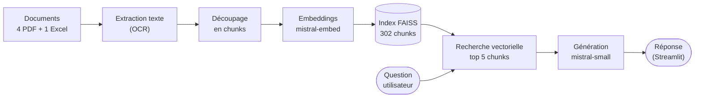
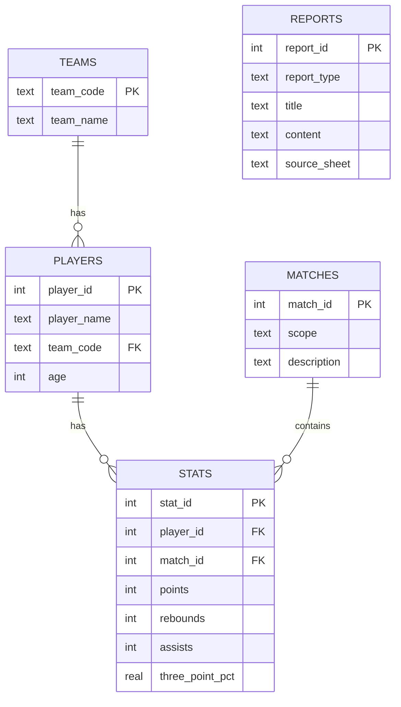

# Rapport de mise en place et d'évaluation du système RAG

## Sommaire

1. [Contexte du projet](#1-contexte-du-projet)
2. [Audit du prototype initial](#2-audit-du-prototype-initial)
3. [Méthodologie d'évaluation](#3-méthodologie-dévaluation)
   - [Jeu de questions](#jeu-de-questions)
   - [Métriques](#métriques)
4. [Évaluation RAG v1 — baseline](#4-évaluation-rag-v1--baseline)
5. [Passage à RAG v2 — contrôlé](#5-passage-à-rag-v2--contrôlé)
   - [Pydantic](#pydantic)
   - [Pydantic AI](#pydantic-ai)
   - [Logfire](#logfire)
6. [Réévaluation RAG v2 — contrôlé](#6-réévaluation-rag-v2--contrôlé)
   - [Comparaison avant / après](#comparaison-avant--après)
   - [Robustesse des résultats](#robustesse-des-résultats)
   - [Limites restantes](#limites-restantes)
7. [RAG v3 — hybride SQL](#7-rag-v3--hybride-sql)
   - [Ce que contient le fichier Excel](#ce-que-contient-le-fichier-excel)
   - [Schéma de base retenu](#schéma-de-base-retenu)
   - [Pipeline d'ingestion](#pipeline-dingestion)
   - [SQL Tool LangChain en lecture seule](#sql-tool-langchain-en-lecture-seule)
   - [Routage intégré](#routage-intégré--lassistant-choisit-son-chemin)
   - [Résultats du routage](#résultats--avant--après-routage)
   - [Choix du mode hybride](#choix-du-mode-hybride)
8. [Conclusion](#8-conclusion)
- [Annexe — exemples de requêtes SQL](#annexe--exemples-de-requêtes-sql)

---

## 1. Contexte du projet

L'application est un assistant conversationnel sur la NBA. Elle permet d'interroger des discussions de fans, des rapports et des statistiques de saison.

Elle repose sur un pipeline RAG (*Retrieval-Augmented Generation*). Avant de répondre, le système cherche des passages pertinents dans les documents. Il demande ensuite à un modèle de langage de rédiger une réponse à partir de ces passages.

Les sources sont mixtes :

- quatre PDF de discussions Reddit (captures d'écran, texte extrait par OCR) ;
- un fichier Excel de statistiques de saison (`regular NBA.xlsx`).

Le travail suit trois axes :

1. auditer le prototype et identifier ses limites ;
2. évaluer le RAG avec RAGAS, puis mesurer l'effet des modifications ;
3. préparer un accès SQL aux données chiffrées.

Pour simplifier la lecture, les versions sont nommées ainsi :

| Nom | Description | Tag Git prévu |
|---|---|---|
| **RAG v1 — baseline** | pipeline RAG initial | `rag-v1-baseline` |
| **RAG v2 — contrôlé** | ajout de Pydantic, Pydantic AI et Logfire | `rag-v2-controlled` |
| **RAG v3 — hybride SQL** | ajout de SQLite et du SQL Tool pour les questions chiffrées | `rag-v3-sql-hybrid` |

---

## 2. Audit du prototype initial

L'audit complet est disponible dans `docs/audit_initial.md` et `notebooks/audit.ipynb`.

### Fonctionnement du prototype

Le prototype suit ce flux :



Chaque étape en une phrase :

- **Extraction** : le texte est extrait des PDF (par OCR pour les captures Reddit) et du fichier Excel (converti en texte).
- **Découpage en chunks** : les documents sont découpés en morceaux d'environ 1 500 caractères, plus faciles à rechercher.
- **Embeddings** : chaque chunk est transformé en vecteur numérique qui représente son sens (modèle `mistral-embed`).
- **Index FAISS** : les vecteurs sont stockés dans un index de recherche rapide.
- **Recherche vectorielle** : pour chaque question, les 5 chunks les plus proches sont récupérés.
- **Génération** : un modèle Mistral (`mistral-small-latest`) rédige la réponse à partir de la question et des chunks.

L'interface est une application Streamlit (`MistralChat.py`). L'indexation produit 302 chunks à partir de 5 documents.

### Ce qui fonctionne

- le pipeline tourne de bout en bout ;
- l'index FAISS est construit (302 chunks) ;
- la recherche vectorielle retourne des contextes ;
- l'application répond aux questions.

### Limites observées

- les réponses peuvent être peu ancrées dans les sources : le prompt initial (« animer le débat ») n'oblige pas le modèle à se limiter aux contextes ;
- les questions chiffrées sont fragiles ;
- FAISS retrouve du texte proche, mais ne calcule rien : il ne sait pas trouver un maximum dans le fichier Excel ;
- l'OCR des PDF Reddit ajoute du bruit ;
- les questions hors sujet ne sont pas toujours refusées (testé avec une recette de cuisine : le modèle répond souvent).

### Exemple de limite

À la question « quel joueur a le meilleur pourcentage à 3 points ? », le modèle peut répondre **Shai Gilgeous-Alexander — 37,5 %**. Pourtant, un extrait récupéré contient déjà **Nikola Jokić — 41,7 %**.

Le système reformule un passage. Il ne calcule pas le maximum de la colonne. Le RAG seul ne suffit donc pas pour les questions de calcul.


---

## 3. Méthodologie d'évaluation

Pour mesurer le comportement du prototype, une évaluation automatique a été mise en place avec RAGAS. Le script `scripts/evaluate_ragas.py` exécute le vrai pipeline de l'application sur chaque question, puis calcule les métriques. Les résultats sont écrits dans `evaluation/results/`.

### Jeu de questions

Un jeu de 15 questions est défini dans `evaluation/evaluation_questions.csv`. Chaque ligne contient la question, sa catégorie, le comportement attendu et une réponse de référence courte. Un champ `requires_sql_future` marque les questions qui demandent un calcul.

Les catégories couvrent des cas variés : simple (2), complexe (2), chiffrée (5), mixte (2), bruitée (2), hors sujet (2). Une fois la première évaluation calculée, le jeu de questions n'est plus modifié.

> **Pourquoi figer le jeu de questions ?**
> Pour comparer deux versions du pipeline, il faut les mesurer sur les mêmes questions. Sinon, on ne sait plus si l'écart vient du pipeline ou des questions.

Des exemples par catégorie :

| Catégorie | Exemple | Ce que le cas teste |
|---|---|---|
| simple | « Pour quelle équipe joue Nikola Jokić d'après les données de la saison ? » | Lecture directe d'une information présente dans les contextes. |
| complexe | « D'après les discussions Reddit, quels arguments pour et contre le tournoi play-in les fans avancent-ils ? » | Synthèse de plusieurs passages, sur des chunks bruités. |
| chiffrée | « Quel joueur a le meilleur pourcentage à 3 points (3P%) cette saison ? » | Calcul d'un maximum — cas d'hallucination observé à l'audit. |
| mixte | « Quel joueur a délivré le plus de passes décisives, et qu'est-ce que cela révèle de son rôle ? » | Un chiffre à trouver, puis une interprétation. |
| bruitée | « kl vs okc stts rebnd lst 5 gm?? » | Robustesse face à une question mal écrite. |
| hors sujet | « Quelle est la recette de la ratatouille ? » | Garde-fou : le refus est attendu. |

### Métriques

RAGAS mesure la qualité des réponses d'un RAG. Quatre métriques sont utilisées, chacune entre 0 et 1 :

- **faithfulness** : la réponse est-elle appuyée sur les contextes récupérés ? C'est l'ancrage ;
- **answer_relevancy** : la réponse répond-elle à la question ?
- **context_precision** : les contextes récupérés sont-ils pertinents ?
- **context_recall** : les contextes couvrent-ils la réponse attendue ?

Le juge qui attribue ces scores est lui-même un modèle de langage (`mistral-large-latest`). Ses scores varient d'un run à l'autre, même sans changer le pipeline. Les résultats se lisent donc comme des tendances.

---

## 4. Évaluation RAG v1 — baseline

Première évaluation du pipeline RAG v1 — baseline, avant toute modification de la génération :

| Métrique | Score |
|---|---:|
| `faithfulness` | 0,2512 |
| `answer_relevancy` | 0,5760 |
| `context_precision` | 0,3622 |
| `context_recall` | 0,4000 |

Lecture :

- la **faithfulness est faible** : les réponses ne sont pas toujours assez appuyées sur les sources ;
- l'**answer_relevancy est correcte**, mais ne suffit pas : une réponse peut sembler utile tout en étant mal ancrée ;
- les **métriques de contexte** restent limitées : les bons passages ne sont pas toujours retrouvés, surtout pour les questions chiffrées.

Le système fonctionne, mais il a des limites mesurables. C'est le point de départ des améliorations.

---

## 5. Passage à RAG v2 — contrôlé

RAG v2 — contrôlé ajoute trois briques, sans changer le modèle de génération ni la récupération FAISS : validation des données avec Pydantic, génération structurée avec Pydantic AI, traçage optionnel avec Logfire.

### Pydantic

Pydantic est une librairie de validation : on décrit la forme attendue d'un objet, elle vérifie que les données la respectent.

Les modèles de `utils/schemas.py` valident les objets du pipeline :

- les **documents** chargés (texte non vide, source connue) ;
- les **chunks** indexés (identifiant, texte, métadonnées) ;
- les **contextes récupérés** (texte, score, source) ;
- la **réponse finale** (réponse non vide, contextes utilisés).

Les erreurs de structure sont ainsi détectées tôt, au lieu de se propager dans le pipeline.

### Pydantic AI

La génération est centralisée dans `utils/rag_agent.py`, sous forme d'un agent Pydantic AI.

Pydantic AI encadre les appels au modèle : on déclare le type de sortie attendu, et la sortie est validée avec Pydantic. L'agent utilise Mistral (`mistral-small-latest`, température 0,1, même prompt que le prototype), reçoit la question et les contextes FAISS, et produit une sortie typée `RagAnswerOutput` (réponse non vide).

Point important : `MistralChat.py` (l'application) et `scripts/evaluate_ragas.py` (l'évaluation) utilisent **le même agent**. L'évaluation mesure donc le même chemin de génération que l'application.

Pydantic AI ne rend pas le modèle meilleur en soi. Il rend la génération plus structurée : sortie au format garanti, validation systématique, code unique. Si le modèle renvoie une réponse vide, l'agent lève une erreur ; le script d'évaluation gère ce cas avec quelques ré-essais.

### Logfire

Logfire est un outil de traçage : il enregistre ce qui se passe pendant l'exécution et l'affiche dans une interface web.

Son intégration est optionnelle et non bloquante :

- **sans token** (clé d'accès), l'application fonctionne normalement, rien n'est envoyé ;
- **avec token**, les étapes clés sont tracées : recherche vectorielle, génération (un span par question, appels Mistral inclus), évaluation RAGAS.

Cela aide à comprendre le comportement du pipeline : temps passé par étape, erreurs API, contextes récupérés.


---

## 6. Réévaluation RAG v2 — contrôlé

Après le passage à RAG v2 — contrôlé, l'évaluation a été relancée : mêmes questions, mêmes métriques, même juge. La génération passe par l'agent Pydantic AI ; la récupération FAISS est inchangée.

### Comparaison avant / après

| Métrique | Avant | Après | Évolution |
|---|---:|---:|---:|
| `faithfulness` | 0,2512 | 0,3534 | +0,1022 |
| `answer_relevancy` | 0,5760 | 0,5520 | −0,0240 |
| `context_precision` | 0,3622 | 0,3622 | 0,0000 |
| `context_recall` | 0,4000 | 0,4333 | +0,0333 |

Lecture :

- la **faithfulness augmente** nettement : les réponses sont mieux appuyées sur les contextes ;
- l'**answer_relevancy baisse légèrement** ;
- la **context_precision** est identique et le **context_recall** progresse légèrement : attendu, la récupération n'a pas changé (vérifié question par question) ;
- l'évolution vient donc de la génération.

Le juge varie d'un run à l'autre, et ce tableau compare un seul run de chaque version. Il indique une tendance favorable sur l'ancrage, pas une preuve. La sous-section suivante mesure cette variabilité.

### Robustesse des résultats

Pour mesurer la variabilité, l'évaluation a été relancée 5 fois pour chaque version du pipeline (runs indépendants, mêmes conditions). `faithfulness` par run :

| Run | Avant (ancien pipeline) | Après (agent Pydantic AI) |
|---|---:|---:|
| run 0 | 0,251 | 0,353 |
| run 1 | 0,238 | 0,334 |
| run 2 | 0,188 | 0,393 |
| run 3 | 0,289 | 0,391 |
| run 4 | 0,278 | 0,310 |
| **Moyenne** | **0,249** | **0,356** |
| **Étendue** | 0,188–0,289 | 0,310–0,393 |
| **Écart-type** | 0,040 | 0,036 |

Ce test répond à la question laissée ouverte : la hausse de `faithfulness` (+0,10) est-elle un vrai effet ou une variation du juge ? C'est un vrai effet. La moyenne passe de 0,249 à 0,356, l'écart dépasse la variabilité du juge (±0,04), et les deux groupes ne se recouvrent pas : le plus haut score de l'ancien pipeline (0,289) reste sous le plus bas score avec l'agent (0,310). Le gain d'ancrage vient donc du changement de génération, pas du hasard du juge. En contrepartie, l'`answer_relevancy` moyenne baisse (≈ 0,50 contre ≈ 0,65) : des réponses plus collées aux sources, mais un peu moins directes. Avec 5 + 5 runs, on reste mesuré : tendance nette, pas preuve absolue.

### Limites restantes

- le RAG reste fragile pour les questions qui demandent un calcul exact (maximum, moyenne, classement) ;
- FAISS cherche du texte proche, il ne calcule pas : les données Excel demandent une brique structurée ;
- les PDF OCR peuvent contenir du bruit ;
- les questions hors sujet ne sont pas systématiquement refusées ;
- RAGAS dépend d'un juge LLM : les scores se lisent comme des tendances.

---

## 7. RAG v3 — hybride SQL

RAG v3 — hybride SQL complète le RAG texte avec un accès structuré aux statistiques. Le fichier Excel est chargé dans une base SQLite, interrogée avec un SQL Tool LangChain en lecture seule. Le routeur oriente chaque question vers le bon traitement : RAG texte, SQL, réponse hybride ou refus hors périmètre.

> **Pourquoi SQL est nécessaire ?**
> La recherche vectorielle retrouve des passages proches de la question. Elle ne sait pas calculer un maximum, une moyenne ou un classement. Pour répondre « quel joueur a le meilleur pourcentage à 3 points ? », il faut une vraie requête sur les données.

### Ce que contient le fichier Excel

- **569 joueurs**, répartis dans **30 équipes** ;
- **45 colonnes utiles** de statistiques (points, rebonds, passes, pourcentages…) ;
- 0 valeur manquante sur les colonnes utiles, 0 doublon de joueur ;
- une feuille `Equipe` (référentiel des 30 équipes) et une feuille `Analyse` (résumé par équipe, top 15 des marqueurs).

Limite importante : le fichier ne contient **pas de matchs individuels**. Les statistiques sont agrégées au niveau joueur-saison.

### Schéma de base retenu

Cinq tables structurent les données :

- `teams` : référentiel des équipes (justifié par la feuille `Equipe`) ;
- `players` : les joueurs, rattachés à leur équipe ;
- `matches` : table minimaliste — elle représente le périmètre de la saison régulière, sans inventer de matchs ;
- `stats` : les statistiques de saison par joueur ;
- `reports` : les blocs d'analyse textuels de la feuille `Analyse`.



Trois points repérés à l'analyse et traités dès l'import :

- la colonne `3PM` est interprétée par Excel comme une heure (`15:00:00`) : elle est renommée à la lecture ;
- les classements par pourcentage demandent un filtre de volume (au moins 100 tentatives), sinon un joueur à 1 tir réussi sur 1 apparaît à 100 % ;
- les pourcentages sont stockés tels quels (`37.5` pour 37,5 %), sans conversion.

### Pipeline d'ingestion

Le pipeline est : `Excel → validation Pydantic → SQLite → requêtes de contrôle`. Chaque ligne est validée avant insertion (`utils/sql/schemas.py`). La base est générée localement :

```bash
poetry run python scripts/load_excel_to_db.py
```

Contrôles sur la base générée : 30 équipes, 569 joueurs, 569 lignes de statistiques, 1 ligne `matches`, 2 rapports ; 0 ligne orpheline, 0 violation de clé étrangère. Meilleur marqueur : Shai Gilgeous-Alexander (2 485 points). Meilleur 3P% avec au moins 100 tentatives : Seth Curry (45,6 %).

### SQL Tool LangChain en lecture seule

Le module `utils/sql/sql_tool.py` expose l'outil qui interroge cette base, en deux niveaux :

- une fonction interne sécurisée, `run_read_only_query()`, qui contrôle puis exécute la requête ;
- un vrai tool LangChain (`StructuredTool`), nommé `nba_sql_query`, avec un schéma d'entrée Pydantic (`query`, `params`, `limit`). C'est lui qui sera branché sur l'assistant.

Règles de sécurité (lecture seule stricte) :

- seules les requêtes `SELECT` (ou `WITH`) sont acceptées ;
- les mots-clés d'écriture sont refusés (`INSERT`, `UPDATE`, `DELETE`, `DROP`, `PRAGMA`…) ;
- une seule requête à la fois : `SELECT …; DROP TABLE …` est refusé ;
- le nombre de lignes retournées est plafonné (20 par défaut) ;
- la connexion SQLite est ouverte en mode lecture seule : même une requête qui passerait les filtres ne pourrait pas écrire.

Exemples de questions qui passeront par SQL :

- « Quel joueur a marqué le plus de points ? »
- « Qui a le meilleur pourcentage à 3 points avec au moins 100 tentatives ? »
- « Combien de joueurs par équipe ? »
- « Quelles sont les stats de Nikola Jokić ? »

Les questions sur les documents (« que disent les fans sur les Lakers ? ») restent côté RAG texte.

Exemple d'appel :

```python
sql_query_tool.invoke({
    "query": "SELECT p.player_name, s.points FROM stats s "
             "JOIN players p ON p.player_id = s.player_id "
             "ORDER BY s.points DESC",
    "limit": 2,
})
# [{'player_name': 'Shai Gilgeous-Alexander', 'points': 2485},
#  {'player_name': 'Anthony Edwards', 'points': 2180}]
```

Le tool renvoie des données structurées ; l'assistant rédigera la réponse.

Le module est couvert par 20 tests sans appel API (`tests/test_sql_tool.py`) : requêtes valides, refus d'écriture, plafond de lignes, erreurs propres, appel du tool via `.invoke(...)`.

### Routage intégré : l'assistant choisit son chemin

Le module `utils/router.py` classe chaque question vers quatre chemins, utilisés à la fois par l'application et par l'évaluation :

| Route | Cas | Traitement |
|---|---|---|
| `rag` | documents, opinions, discussions Reddit | FAISS + génération |
| `sql` | question chiffrée | requête contrôlée via le SQL Tool |
| `hybrid` | chiffre + interprétation | SQL d'abord, puis rédaction LLM |
| `out_of_scope` | hors NBA / hors sources | refus poli, aucun appel externe |

Pour les questions chiffrées, le code suit un pipeline contrôlé et traçable :

```text
détecter le cas spécial éventuel
sinon détecter la métrique demandée
sinon détecter le sens du classement
construire une requête SQL sûre
exécuter via le SQL Tool
formater la réponse en français
```

Ce découpage rend le comportement transparent sans ouvrir de génération SQL libre. Les colonnes autorisées viennent d'une liste blanche, le sens du tri est limité à deux constantes internes (`ASC` ou `DESC`), et les noms de joueurs passent en paramètres SQL. Le SQL Tool en lecture seule reste l'unique couche d'exécution.

Une question chiffrée hors couverture reçoit une réponse honnête « non pris en charge » plutôt qu'un résultat inventé.

L'application (`MistralChat.py`) et l'évaluation (`scripts/evaluate_ragas.py`) passent par la même fonction `answer_question()`. L'évaluation mesure donc exactement le même chemin que celui utilisé par l'interface.

L'évaluation officielle porte sur le jeu figé E01–E15, inchangé depuis la baseline. Un petit jeu étendu E16–E20 a aussi été créé pour tester plus spécifiquement le routage et les modes hybrides, mais il est analysé séparément.

### Résultats : avant / après routage

Trois conditions ont été mesurées sur ce jeu (mêmes métriques et même juge que les évaluations précédentes) : tout-RAG (comportement v2), routage avec hybride `sql_only`, routage avec hybride `sql_with_rag_context`.

Scores moyens RAGAS (E01–E15) :

| Condition | faithfulness | answer_relevancy | context_precision | context_recall |
|---|---|---|---|---|
| RAG texte seul (baseline) | 0,374 | 0,437 | 0,362 | 0,433 |
| Routage · hybride `sql_only` | 0,482 | 0,665 | 0,532 | 0,611 |
| Routage · hybride `sql_with_rag_context` | 0,472 | 0,613 | 0,623 | 0,611 |

Le routage améliore les quatre métriques, surtout la pertinence (answer_relevancy 0,44 → 0,61–0,67) et la précision/rappel du contexte, parce que les réponses chiffrées s'appuient désormais sur un fait SQL exact plutôt que sur des extraits approximatifs.

Lecture par catégorie (faithfulness) :

- **chiffrées : 0,49 → 0,70–0,72.** Le gain attendu : le SQL renvoie la valeur exacte (Shai Gilgeous-Alexander 2 485 points ; Seth Curry 45,6 % à 3 points avec le filtre de volume) là où le RAG approximait ou hallucinait ;
- **bruitées : 0,03 → 0,47–0,55.** « meilleur tireur a 3pts cette saion?? » est désormais comprise comme une intention chiffrée et routée vers SQL ;
- **mixtes : 0,15 → 0,17–0,18.** Gain marginal : la part interprétative de la réponse reste difficilement « citable » pour le juge (voir limites) ;
- **hors-sujet : 0,33 → 0,00.** Régression apparente qui n'en est pas une : le refus poli — comportement métier voulu, désormais systématique — ne cite aucun contexte, donc RAGAS le note 0. C'est une limite de la métrique sur les refus, pas du système ; l'appréciation métier se lit séparément.

La distribution des routes sur E01–E15 est conforme à la conception : 5 `rag`, 6 `sql`, 2 `hybrid`, 2 `out_of_scope`.

### Choix du mode hybride

Les deux variantes ne diffèrent que sur les questions `hybrid` (E05 et E06 dans le jeu figé) : `sql_only` rédige à partir du seul chiffre SQL ; `sql_with_rag_context` ajoute quelques extraits FAISS pour la couche qualitative, avec une consigne explicite : les chiffres SQL font foi.

Des runs répétés (3 runs `sql_only`, 2 runs `sql_with_rag_context`) montrent que l'écart entre les deux est un **artefact de la variance du juge**, pas une différence réelle :

| Mode hybride | faithfulness moyenne (E05–E06) | variance run à run |
|---|---|---|
| `sql_only` | 0,19 (3 runs) | E05 : 0,14 / 0,24 / 0,33 |
| `sql_with_rag_context` | 0,22 (2 runs) | E05 : 0,19 / 0,44 |

L'écart résiduel (+0,03) est plus petit que les oscillations du juge sur une même question d'un run à l'autre. Les deux modes sont donc **statistiquement indistinguables** sur la fidélité.

**Choix retenu : `sql_only` par défaut.** À fidélité équivalente, c'est le mode le plus stable, le moins coûteux et le plus facile à expliquer. Le chiffre SQL reste la source de vérité, et aucun contexte texte supplémentaire n'est ajouté quand son apport n'est pas mesurable. Le mode `sql_with_rag_context` reste disponible par configuration (`HYBRID_MODE=sql_with_rag_context`), mais il n'est pas activé par défaut.

### Limites du routage actuel

- routage par règles : robuste sur le jeu testé, mais une question très déformée peut être mal classée (E12 reste en `rag`) ;
- couverture SQL bornée aux requêtes prédéfinies : pas de NL→SQL libre, donc pas de réponse aux agrégats non prévus (ex. splits domicile/extérieur, absents de la base) — l'assistant le dit explicitement ;
- RAGAS juge mal deux familles de réponses correctes : les refus (hors-sujet, note 0 par construction) et les réponses interprétatives des questions mixtes ; le comparatif chiffré est donc complété d'une lecture qualitative des réponses, en particulier sur les questions mixtes.

---

## 8. Conclusion

### Bilan

Le prototype RAG fonctionne : il indexe les documents, retrouve des contextes et répond aux questions.

L'évaluation RAGAS a montré ses limites : ancrage faible (`faithfulness` à 0,25) et questions chiffrées fragiles.

RAG v2 — contrôlé renforce le pipeline avec Pydantic, Pydantic AI et Logfire. Après ces changements, la `faithfulness` moyenne passe de 0,25 à 0,36 sur 5 runs, avec une baisse de la pertinence directe. C'est une tendance à lire avec prudence : le juge varie d'un run à l'autre.

RAG v3 — hybride SQL utilise un routage en quatre chemins : RAG texte pour le documentaire, requêtes SQL prédéfinies pour le chiffré, réponse hybride pour les questions mixtes, refus hors périmètre. Sur le jeu figé E01–E15, le routage fait passer la `faithfulness` moyenne de 0,37 à 0,47–0,48 et la pertinence des réponses de 0,44 à 0,61–0,67, avec des gains concentrés exactement là où le RAG seul échouait : questions chiffrées et questions bruitées à intention chiffrée.

### Prochaine étape

Le choix par défaut du mode hybride est maintenant fixé à `sql_only`, après comparaison avec `sql_with_rag_context`. Les prochaines pistes seraient d'élargir la couverture des intentions chiffrées et de remplacer le routage par règles par un classifieur plus robuste si le besoin apparaît à l'usage, tout en conservant le principe de sécurité : pas de génération SQL libre.

> **Ce qui est exclu du périmètre**
> - pas de fine-tuning du modèle ;
> - pas de changement du modèle principal de génération ;
> - pas de modification du jeu de questions après la baseline ;
> - pas de mise à jour automatique des résultats dans le README : les scores sont reportés manuellement, après vérification.

---

### TODO avant version finale

- [x] Implémenter la brique SQL (pipeline d'ingestion + SQL Tool en lecture seule) et compléter la section 7.
- [x] Intégrer le routage RAG texte / SQL dans l'assistant.
- [x] Ajouter le comparatif RAG seul vs RAG + SQL après évaluation.
- [ ] Relecture finale : vérifier que chaque affirmation reste appuyée par les résultats.

---

## Annexe — exemples de requêtes SQL

Quelques requêtes types sur la base `data/nba.sqlite`, pour illustrer ce que le SQL Tool exécute (lecture seule) :

```sql
-- Nombre de joueurs (attendu : 569)
SELECT COUNT(*) FROM players;

-- Top 10 des marqueurs
SELECT p.player_name, p.team_code, s.points
FROM stats s JOIN players p ON p.player_id = s.player_id
ORDER BY s.points DESC LIMIT 10;

-- Meilleur 3P% avec filtre de volume (évite l'artefact d'un joueur à 1 tir sur 1)
SELECT p.player_name, s.three_point_pct, s.three_points_attempted
FROM stats s JOIN players p ON p.player_id = s.player_id
WHERE s.three_points_attempted >= 100
ORDER BY s.three_point_pct DESC LIMIT 5;
```
