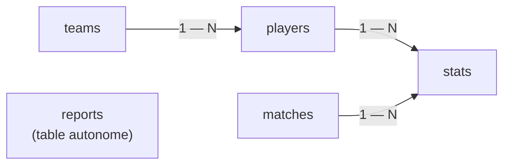
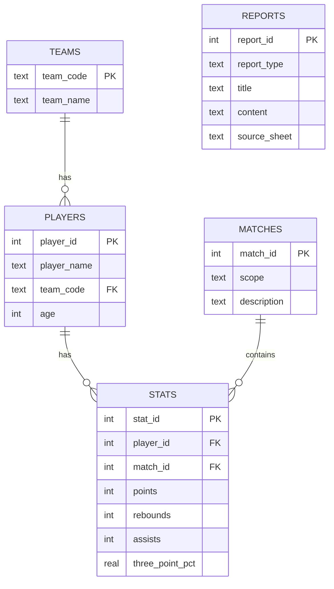

# Rapport de mise en place et d'évaluation du système RAG

## Sommaire

1. [Contexte du projet](#1-contexte-du-projet)
2. [Audit du prototype initial](#2-audit-du-prototype-initial)
3. [Évaluation RAGAS](#3-évaluation-ragas)
   - [Jeu de questions](#jeu-de-questions)
   - [Métriques](#métriques)
4. [Évaluation baseline](#4-évaluation-baseline)
5. [Modifications](#5-modifications)
   - [Pydantic](#pydantic)
   - [Pydantic AI](#pydantic-ai)
   - [Logfire](#logfire)
6. [Réévaluation](#6-réévaluation)
7. [Renforcement SQL](#7-renforcement-sql)
8. [Conclusion](#8-conclusion)

---

## 1. Contexte du projet

L'application est un assistant conversationnel sur la NBA. Il est destiné à des analystes et des entraîneurs qui veulent interroger leurs documents : discussions de fans, rapports, statistiques de saison.

L'assistant repose sur un pipeline RAG (*Retrieval-Augmented Generation*). Le principe est simple : avant de répondre, le système cherche des passages pertinents dans les documents, puis demande à un modèle de langage de rédiger une réponse appuyée sur ces passages.

Les sources sont mixtes :

- quatre PDF de discussions Reddit, sous forme de captures d'écran, dont le texte est extrait par OCR (reconnaissance de texte dans des images) ;
- un fichier Excel de statistiques NBA (`regular NBA.xlsx`), avec les chiffres de la saison régulière par joueur.

Le travail présenté ici suit trois axes :

1. auditer le prototype existant et identifier ses limites ;
2. évaluer son comportement avec des métriques objectives, puis renforcer le pipeline (Pydantic, Pydantic AI, Logfire) et mesurer l'effet de ces modifications ;
3. préparer un accès aux chiffres via une base SQL.

---

## 2. Audit du prototype initial

L'audit complet est disponible dans `docs/audit_initial.md` et `notebooks/audit.ipynb`.

### Fonctionnement du prototype

Le prototype suit ce flux :

Chaque étape en une phrase :

- **Extraction** : le texte est extrait des PDF (par OCR pour les captures Reddit) et du fichier Excel (converti en texte).
- **Découpage en chunks** : les documents sont découpés en morceaux de texte d'environ 1 500 caractères, plus faciles à rechercher.
- **Embeddings** : chaque chunk est transformé en vecteur numérique qui représente son sens (modèle `mistral-embed`).
- **Index FAISS** : les vecteurs sont stockés dans un index qui permet de retrouver rapidement les chunks les plus proches d'une question.
- **Recherche vectorielle** : pour chaque question, les 5 chunks les plus proches sont récupérés.
- **Génération** : un modèle Mistral (`mistral-small-latest`) rédige la réponse à partir de la question et des chunks récupérés.

L'interface utilisateur est une application Streamlit (`MistralChat.py`). L'indexation produit 302 chunks à partir de 5 documents.

### Ce qui fonctionne

- le pipeline tourne de bout en bout ;
- l'index FAISS est construit (302 chunks) ;
- la recherche vectorielle retourne des contextes ;
- l'application répond aux questions.

### Limites observées

- les réponses peuvent être peu ancrées dans les sources : le prompt initial (« animer le débat ») n'oblige pas le modèle à se limiter aux contextes récupérés ;
- les questions chiffrées sont fragiles ;
- FAISS retrouve du texte proche, mais ne calcule rien : il ne sait pas trouver un maximum dans le fichier Excel ;
- l'OCR des PDF Reddit ajoute du bruit (erreurs de reconnaissance, mise en page mal reconstruite) ;
- les questions hors sujet ne sont pas toujours refusées (testé avec une recette de cuisine : le modèle répond souvent).

### Un exemple révélateur

À la question « quel joueur a le meilleur pourcentage à 3 points ? », le modèle peut répondre **Shai Gilgeous-Alexander — 37,5 %**, alors qu'un extrait récupéré contient déjà **Nikola Jokić — 41,7 %**. Le système reformule un passage : il ne calcule pas le maximum de la colonne. Le RAG seul ne suffit donc pas pour les questions de calcul.

---

## 3. Évaluation RAGAS

Pour mesurer objectivement le comportement du prototype, une évaluation automatique a été mise en place avec RAGAS. Le script `evaluate_ragas.py` exécute le vrai pipeline de l'application sur chaque question, puis calcule les métriques. Les résultats sont écrits dans `evaluation/results/`.

### Jeu de questions

Un dataset de 15 questions a été créé dans `evaluation/evaluation_questions.csv`. Chaque ligne contient la question, sa catégorie, le comportement attendu, une réponse de référence courte et un champ `requires_sql_future` qui marque les questions nécessitant un calcul.

Les catégories couvrent des cas variés : simple (2), complexe (2), chiffrée (5), mixte (2), bruitée (2), hors sujet (2). Une fois la première évaluation calculée, le dataset n'est plus modifié.

> **Pourquoi figer le dataset ?**
> Pour comparer deux versions du pipeline, il faut les mesurer sur les mêmes questions. Si le dataset change entre deux évaluations, on ne sait plus si l'écart vient du pipeline ou des questions.

Des exemples par catégorie :

| Catégorie | Exemple du dataset | Ce que le cas teste |
|---|---|---|
| simple | « Pour quelle équipe joue Nikola Jokić d'après les données de la saison ? » | Lecture directe d'une information présente dans les contextes. |
| complexe | « D'après les discussions Reddit, quels arguments pour et contre le tournoi play-in les fans avancent-ils ? » | Synthèse de plusieurs passages, sur des chunks bruités. |
| chiffrée | « Quel joueur a le meilleur pourcentage à 3 points (3P%) cette saison ? » | Calcul d'un maximum — cas d'hallucination observé à l'audit. |
| mixte | « Quel joueur a délivré le plus de passes décisives, et qu'est-ce que cela révèle de son rôle ? » | Un chiffre à trouver, puis une interprétation. |
| bruitée | « kl vs okc stts rebnd lst 5 gm?? » | Robustesse face à une question mal écrite (abréviations, fautes). |
| hors sujet | « Quelle est la recette de la ratatouille ? » | Garde-fou : le refus est attendu, pas une recette. |

### Métriques

RAGAS mesure automatiquement la qualité des réponses d'un RAG. Quatre métriques sont utilisées, chacune entre 0 et 1 :

- **faithfulness** : la réponse est-elle appuyée par les contextes récupérés ? (mesure l'ancrage, c'est-à-dire l'absence d'invention) ;
- **answer_relevancy** : la réponse répond-elle à la question posée ?
- **context_precision** : les contextes récupérés sont-ils pertinents ?
- **context_recall** : les contextes couvrent-ils la réponse attendue ?

Le « juge » qui attribue ces scores est lui-même un modèle de langage (`mistral-large-latest`). Il n'est pas déterministe : les scores varient d'un run à l'autre, même sans changer le pipeline. Les résultats se lisent donc comme des tendances, pas comme des valeurs exactes.

---

## 4. Évaluation baseline

Première évaluation du prototype, avant toute modification de la génération :

| Métrique | Score |
|---|---:|
| `faithfulness` | 0,2512 |
| `answer_relevancy` | 0,5760 |
| `context_precision` | 0,3622 |
| `context_recall` | 0,4000 |

Lecture de ces chiffres :

- la **faithfulness est faible** : les réponses ne sont pas toujours assez appuyées sur les sources ;
- l'**answer_relevancy est correcte**, mais elle ne suffit pas : une réponse peut sembler répondre à la question tout en étant mal appuyée ;
- les **métriques de contexte** montrent que la récupération FAISS reste limitée : les bons passages ne sont pas toujours retrouvés, notamment pour les questions chiffrées.

Le système fonctionne, mais il a des limites mesurables. C'est le point de départ pour les améliorations.

---

## 5. Modifications

Trois renforts ont été ajoutés au pipeline, sans changer le modèle de génération ni la récupération FAISS : la validation des données (Pydantic), la génération structurée (Pydantic AI) et le traçage optionnel (Logfire).

### Pydantic

Pydantic est une librairie de validation de données : on décrit la forme attendue d'un objet (champs, types, contraintes), et elle vérifie que les données respectent cette forme.

Des modèles Pydantic ont été ajoutés dans `utils/schemas.py`. Ils valident les objets qui circulent dans le pipeline :

- les **documents** chargés (texte non vide, source connue) ;
- les **chunks** indexés (identifiant, texte, métadonnées complètes) ;
- les **contextes récupérés** par la recherche (texte, score de similarité, source) ;
- la **réponse finale** (question, réponse non vide, liste des contextes utilisés).

Deux exemples concrets :

- un contexte récupéré doit avoir un texte, un score et une source — sinon l'erreur est détectée à la recherche, pas plus tard ;
- une réponse finale doit contenir une réponse non vide — une réponse vide est signalée au lieu de passer inaperçue.

L'intérêt : les erreurs de structure sont détectées tôt, au moment où elles se produisent, plutôt que de se propager dans le pipeline.

### Pydantic AI

La génération de la réponse a été centralisée dans `utils/rag_agent.py`, sous forme d'un agent Pydantic AI.

Pydantic AI est une librairie qui encadre les appels à un modèle de langage : on déclare le type de sortie attendu, et la librairie force le modèle à produire une réponse dans ce format, puis la valide avec Pydantic.

Concrètement :

- l'agent utilise Mistral (`mistral-small-latest`, température 0,1, même prompt que le prototype) ;
- il reçoit la question et les contextes récupérés par FAISS ;
- il produit une sortie typée `RagAnswerOutput` (une réponse non vide) ;
- cette sortie est validée par Pydantic avant d'être utilisée.

Point important : `MistralChat.py` (l'application) et `evaluate_ragas.py` (l'évaluation) utilisent **le même agent**. L'évaluation RAGAS mesure donc exactement le chemin de génération servi aux utilisateurs, pas une copie qui pourrait diverger.

Pydantic AI ne rend pas le modèle « meilleur » en soi. Il rend la génération plus structurée et plus contrôlée : sortie au format garanti, validation systématique, code de génération unique. Une conséquence à connaître : si le modèle renvoie une réponse vide, l'agent lève une erreur au lieu de la laisser passer. Le script d'évaluation gère ce cas avec quelques ré-essais.

### Logfire

Logfire est un outil de traçage : il enregistre ce qui se passe pendant l'exécution (durées, étapes, erreurs) et l'affiche dans une interface web.

Son intégration est optionnelle et non bloquante :

- **sans token** (clé d'accès), l'application fonctionne normalement, rien n'est envoyé ;
- **avec token**, les étapes clés sont tracées :
  - la recherche vectorielle (question, nombre de contextes trouvés) ;
  - la génération de la réponse (un span par question, appels Mistral inclus) ;
  - l'évaluation RAGAS (un span englobant, un span par question évaluée).

Cela aide à comprendre le comportement du pipeline : voir le temps passé par étape, repérer les erreurs (par exemple les réponses 429 de l'API), vérifier que la recherche retourne bien des contextes.

---

## 6. Réévaluation

Après ces modifications, l'évaluation a été relancée : même dataset, mêmes métriques, même juge. La génération passe désormais par l'agent Pydantic AI ; la récupération FAISS est inchangée.

### Comparaison avant / après

| Métrique | Avant | Après | Évolution |
|---|---:|---:|---:|
| `faithfulness` | 0,2512 | 0,3534 | +0,1022 |
| `answer_relevancy` | 0,5760 | 0,5520 | −0,0240 |
| `context_precision` | 0,3622 | 0,3622 | 0,0000 |
| `context_recall` | 0,4000 | 0,4333 | +0,0333 |

Lecture :

- la **faithfulness augmente** nettement : les réponses sont mieux appuyées sur les contextes ;
- l'**answer_relevancy baisse légèrement** ;
- la **context_precision est identique** et le **context_recall progresse légèrement** : c'est attendu, la récupération n'a pas changé (vérifié : les contextes récupérés sont identiques question par question) ;
- comme la récupération est inchangée, l'évolution vient de la génération.

Il faut rester prudent : le juge est un modèle de langage, ses scores varient d'un run à l'autre. Ce tableau compare un run avant et un run après. Il indique une tendance favorable sur l'ancrage, pas une preuve. La sous-section suivante mesure cette variabilité.

### Robustesse des résultats

Pour savoir si l'écart de faithfulness est un effet réel ou une variation du juge, l'évaluation a été relancée 5 fois pour chaque version du pipeline, dans les mêmes conditions : 5 runs avec l'ancienne génération (appel direct au modèle, sans agent), 5 runs avec l'agent Pydantic AI. Les 10 runs sont complets : 15/15 questions notées, 0 erreur.

#### Les dix runs côte à côte

`faithfulness` par run, avant (ancien pipeline) et après (agent Pydantic AI) :

| Run | Avant (ancien pipeline) | Après (agent Pydantic AI) |
|---|---:|---:|
| run 0 | 0,251 | 0,353 |
| run 1 | 0,238 | 0,334 |
| run 2 | 0,188 | 0,393 |
| run 3 | 0,289 | 0,391 |
| run 4 | 0,278 | 0,310 |
| **Moyenne** | **0,249** | **0,356** |
| **Étendue** | 0,188–0,289 | 0,310–0,393 |
| **Écart-type** | 0,040 | 0,036 |

Précision de lecture : chaque colonne contient 5 runs indépendants ; les lignes ne se correspondent pas deux à deux (le « run 1 » avant n'a pas de lien avec le « run 1 » après).

Le premier score observé après Pydantic AI (0,353) n'est pas un point isolé : il est proche de la moyenne des 5 runs. La variabilité reste réelle (environ ±0,04 autour de la moyenne) — d'où l'intérêt de comparer des moyennes plutôt que des runs isolés.

#### Ce que montre la comparaison

- Sur ces 10 runs, les deux groupes ne se recouvrent pas : le plus haut score de l'ancien pipeline (0,289) reste sous le plus bas score avec l'agent (0,310). La tendance en faveur d'un meilleur ancrage est donc nette, au-delà de la seule variation du juge.
- En face, l'**answer_relevancy moyenne est plus basse avec l'agent** (≈ 0,50 contre ≈ 0,65 pour l'ancien pipeline). L'évolution n'est pas une amélioration uniforme : c'est un compromis. La sortie structurée semble pousser le modèle à coller aux sources (meilleur ancrage), au prix de réponses un peu moins directes.
- Les métriques de contexte restent dans des plages comparables des deux côtés, ce qui est cohérent : la récupération est identique.

#### Réserves de méthode

- le nombre de runs est petit (5 + 5) : on parle de tendance, pas de preuve absolue ;
- les runs ont été exécutés en deux blocs successifs (agent, puis ancien pipeline). Le modèle étant figé entre deux appels, une dérive entre les blocs est très improbable, mais une alternance des runs aurait été plus rigoureuse.

> **Pourquoi ne pas sur-interpréter RAGAS ?**
> Le juge RAGAS est un modèle de langage. Deux runs identiques donnent des scores différents (ici, jusqu'à ±0,04 sur la moyenne). On compare donc des moyennes et des plages sur plusieurs runs, et on lit les écarts comme des tendances. Une différence de quelques centièmes sur un seul run ne veut rien dire.

Les fichiers détaillés de ces runs sont conservés localement (dossier `evaluation/results/variance_runs/`, non versionné).

### Limites restantes

Après ces renforcements, les limites qui demeurent :

- le RAG reste fragile pour les questions qui demandent un calcul exact (maximum, moyenne, classement) ;
- FAISS cherche du texte proche d'une question. Il ne calcule pas une statistique : il ne remplacera jamais une requête sur des données structurées ;
- les données Excel doivent être traitées avec une brique structurée pour répondre correctement aux questions chiffrées ;
- les PDF OCR peuvent contenir du bruit, qui dégrade la qualité des chunks indexés ;
- les questions hors sujet ne sont pas systématiquement refusées par le modèle ;
- RAGAS dépend d'un juge LLM : les scores se lisent comme des tendances, sur plusieurs runs (voir « Robustesse des résultats »).

---

## 7. Renforcement SQL

La prochaine amélioration consiste à charger le fichier Excel dans une base SQLite. L'objectif est de répondre aux questions chiffrées avec de vrais calculs. Cette étape a été préparée par une analyse du fichier ; le code sera réalisé dans une branche dédiée.

> **Pourquoi SQL est nécessaire ?**
> La recherche vectorielle retrouve des passages proches de la question. Elle ne sait pas calculer un maximum, une moyenne ou un classement dans un tableau. Pour répondre « quel joueur a le meilleur pourcentage à 3 points ? », il faut interroger les données avec une vraie requête.

### Ce que contient le fichier Excel

Le fichier `regular NBA.xlsx` a été inspecté feuille par feuille. Il contient :

- **569 joueurs**, répartis dans **30 équipes** ;
- **45 colonnes utiles** de statistiques (points, rebonds, passes, pourcentages de tir, etc.) ;
- 0 valeur manquante sur les colonnes utiles, 0 doublon de joueur ;
- une feuille `Equipe` qui fournit un référentiel des 30 équipes (code et nom complet) ;
- une feuille `Analyse` avec des blocs déjà préparés (résumé par équipe, top 15 des marqueurs).

Limite importante : le fichier ne contient **pas de matchs individuels**. Les statistiques sont agrégées au niveau joueur-saison.

### Schéma de base retenu

Cinq tables sont prévues pour structurer les données :

- `teams` : référentiel des équipes — table de support justifiée par la feuille `Equipe` ;
- `players` : les joueurs, rattachés à leur équipe ;
- `matches` : table volontairement minimaliste. Le fichier ne contient pas de matchs individuels ; elle représente donc le périmètre de la saison régulière, sans inventer de matchs ;
- `stats` : les statistiques de saison par joueur ;
- `reports` : les blocs d'analyse textuels issus des feuilles `Analyse` et `Dictionnaire des données`.

Relations principales :

### Garde-fous déjà identifiés

L'analyse du fichier a fait remonter deux points à traiter dès l'import :

- la colonne `3PM` (tirs à 3 points réussis) est interprétée par Excel comme une heure (`15:00:00`) : elle devra être renommée et convertie explicitement ;
- pour les classements par pourcentage, un filtre de volume sera nécessaire (par exemple : au moins 100 tentatives). Sans ce filtre, un joueur avec 1 tir réussi sur 1 apparaît à 100 % et fausse la réponse.

### Pipeline d'ingestion prévu

Le pipeline prévu est : `Excel → validation Pydantic → SQLite → requêtes SQL de contrôle`. Les lignes seront validées par des modèles Pydantic avant insertion. Cela prolonge le travail de sécurisation déjà fait sur le pipeline RAG.

`TODO : implémenter le pipeline SQL dans une branche dédiée, puis compléter cette section avec les résultats des requêtes de contrôle (nombre de joueurs, top des marqueurs, classement 3 points filtré).`

`TODO : après intégration de l'outil SQL dans l'assistant, relancer l'évaluation RAGAS et ajouter le comparatif avant/après SQL.`

---

## 8. Conclusion

### Bilan

Le prototype RAG fonctionne : il indexe les documents, retrouve des contextes et répond aux questions.

L'évaluation a permis de mesurer ses limites. La première baseline RAGAS a montré un ancrage faible des réponses (`faithfulness` à 0,25) et a confirmé la fragilité des questions chiffrées.

Pydantic et Pydantic AI ont renforcé la structure du pipeline : données validées, génération centralisée, sortie typée, même chemin de génération pour l'application et l'évaluation. Logfire ajoute une visibilité optionnelle sur l'exécution.

Après ces changements, les résultats RAGAS montrent une amélioration de l'ancrage des réponses : `faithfulness` moyenne de 0,25 à 0,36 sur 5 runs. En contrepartie, la pertinence directe des réponses baisse. Ces résultats restent à lire comme une tendance, car le juge LLM varie d'un run à l'autre.

### Prochaine étape

La limite principale reste les questions chiffrées. La recherche vectorielle ne calcule pas. La prochaine étape est donc l'ajout d'une base SQLite alimentée depuis le fichier Excel, puis d'un outil SQL pour l'assistant. Une nouvelle évaluation permettra ensuite de comparer le RAG seul et le RAG renforcé par SQL.

> **Ce qui a été volontairement exclu**
> - pas de fine-tuning du modèle ;
> - pas de changement du modèle principal de génération ;
> - pas de modification du jeu de questions après la baseline ;
> - pas de mise à jour automatique des résultats dans le README : les scores sont reportés manuellement, après vérification.

---

### TODO avant version finale

- [ ] Implémenter la brique SQL, puis compléter la section 7 (résultats des requêtes de contrôle).
- [ ] Ajouter le comparatif RAG seul vs RAG + SQL après la seconde évaluation (sections 7/8).
- [ ] Relecture finale : vérifier que chaque affirmation reste appuyée par les résultats.
