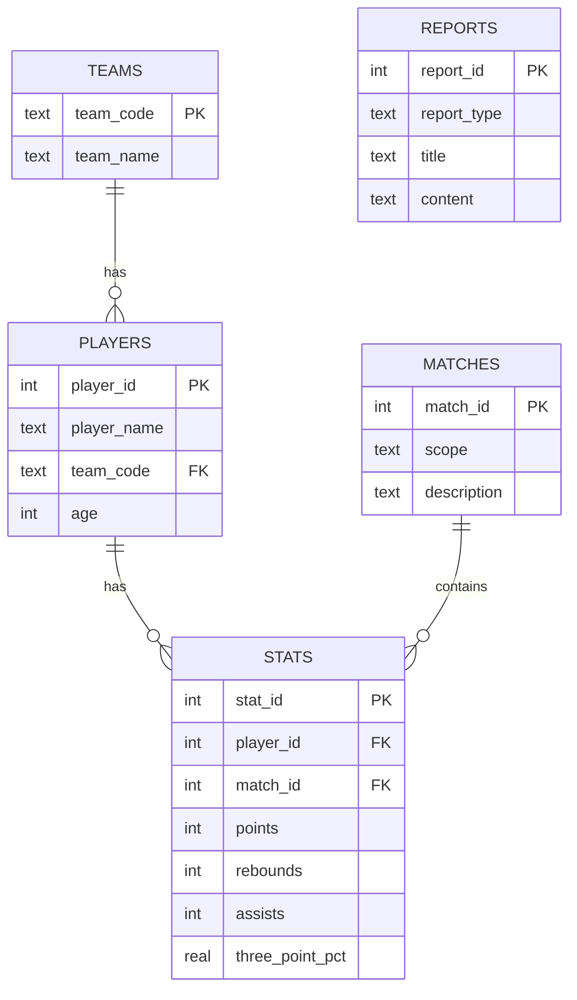

# Base SQLite NBA — schéma et limites

## Objectif

Charger les statistiques du fichier Excel dans une base SQLite locale, pour que les questions chiffrées (maximum, classement, comparaison) puissent être traitées par de vraies requêtes SQL — ce que la recherche vectorielle du RAG ne sait pas faire. Cette base servira au futur SQL Tool de l'assistant.

## Source

Fichier : `inputs/regular NBA.xlsx`.

| Feuille | Usage |
|---|---|
| `Données NBA` | 569 joueurs × 45 colonnes utiles (statistiques agrégées de saison) |
| `Equipe` | Référentiel des 30 équipes (code + nom complet) |
| `Analyse` | Blocs d'analyse repris dans la table `reports` |

Particularité corrigée à la lecture : la cellule d'en-tête `3PM` est interprétée par Excel comme une heure (`15:00:00`) ; elle est renommée explicitement en `3PM` (`utils/sql/load_excel.py`).

## Générer la base

```bash
poetry run python scripts/load_excel_to_db.py
```

La base `data/nba.sqlite` est supprimée puis recréée à chaque exécution (non versionnée). Pipeline : `Excel → validation Pydantic → SQLite → requêtes de contrôle`. Chaque ligne est validée par un modèle Pydantic (`utils/sql/schemas.py`) avant insertion.

## Schéma



- `teams` — table de support justifiée par la feuille `Equipe` (30 lignes).
- `players` — un joueur par ligne, rattaché à son équipe (569 lignes, noms uniques).
- `matches` — **une seule ligne** : `scope = regular_season_2024_2025`. Elle représente le périmètre des données, pas des matchs réels.
- `stats` — une ligne par joueur (569), reliée à `players` et `matches`, avec les 42 colonnes statistiques de la feuille (points, rebonds, passes, pourcentages, ratings…). Contrainte `UNIQUE(player_id, match_id)`.
- `reports` — les blocs réellement présents dans la feuille `Analyse` : résumé par équipe et top 15 des marqueurs. Aucun contenu inventé.

## Limites importantes

- **Pas de matchs individuels** : le fichier ne contient ni dates, ni adversaires, ni scores de matchs. Les statistiques sont agrégées au niveau joueur-saison. La table `matches` reste donc minimale et documentée — aucun match n'est inventé.
- Les pourcentages sont stockés tels quels (ex. `37.5` pour 37,5 %).
- Pour les classements par pourcentage, un **filtre de volume** est nécessaire (ex. `three_points_attempted >= 100`) : sans lui, un joueur à 1 tir réussi sur 1 apparaît à 100 %.

## Exemples de requêtes

```sql
-- Nombre de joueurs (attendu : 569)
SELECT COUNT(*) FROM players;

-- Top 10 des marqueurs
SELECT p.player_name, p.team_code, s.points
FROM stats s JOIN players p ON p.player_id = s.player_id
ORDER BY s.points DESC LIMIT 10;

-- Meilleur 3P% avec filtre de volume
SELECT p.player_name, s.three_point_pct, s.three_points_attempted
FROM stats s JOIN players p ON p.player_id = s.player_id
WHERE s.three_points_attempted >= 100
ORDER BY s.three_point_pct DESC LIMIT 5;
```

Les requêtes de contrôle sont centralisées dans `utils/sql/queries.py` et vérifiées par `tests/test_sqlite_schema.py`.
